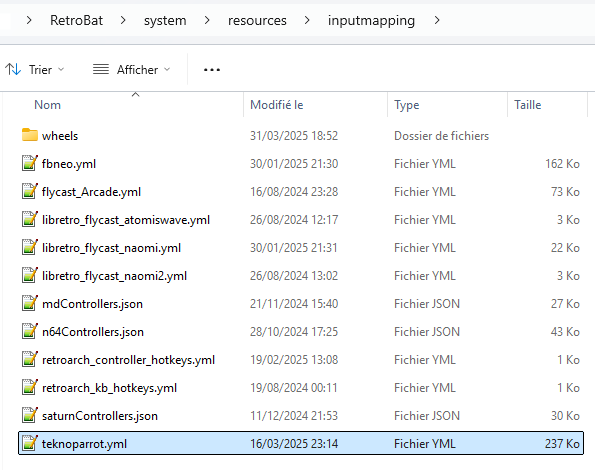
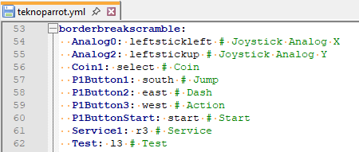
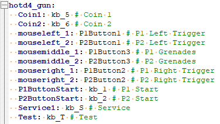

# Teknoparrot controller mapping

There are many different types of Teknoparrot games, and it's difficult to adapt a common configuration to all game variants, such as racing, shooting or others. It can also be difficult to reproduce the characteristic gameplay of certain arcade versions. So, if the default configuration we've prepared doesn't suit you, or doesn't work with the controller you're using, you can customize the controls for each game.\
\
Here's how.

## Location of configuration files

By default, since RetroBat V7, a basic configuration has been added for the vast majority of available Teknoparrot games (excluding Patreon). This configuration can be found in the `\system\resources\inputmapping\teknoparrot.yml`&#x20;

<figure><figcaption></figcaption></figure>

The contents of this file must respect a particular layout to ensure its proper functioning.\
First, it contains :

* the name of the gameprofile.xml file corresponding to the game: the container.\
  The container must be named exactly like the corresponding configuration file, which can be found in `\emulators\teknoparrot\GameProfiles\` . It must be entered in lower case (and without the extension),
* then follows, in order and “by column” :&#x20;
  * the value present in the gameprofile, between the \<InputMapping> tags
  * lthe button that performs the action on the controller
  * the corresponding action in the game\

<figure><figcaption></figcaption></figure>

Each line thus contains all the InputMapping values present in the gameprofile.

## Change mapping

You can also customize the buttons to suit your needs.\
The list of values that can be set for the controller are :\
r3, l3, select, start, righttrigger, lefttrigger, rightshoulder, leftshoulder, south, east, west, north, up, down, left, right, leftstickleft, leftstickright, leftstickup, leftstickdown, rightstickleft, rightstickright, rightstickup, rightstickdown

It's also possible to create a specific setting if you're using a lightgun. To do this, simply repeat the operation, but add `_gun` to the container name.

Gun games often have 3 buttons recognized as mouse actions.\
To fill in this type of action, you need to reverse the order of entry, and use the list of buttons below instead of the value present between the InputMapping tags:\
mouseleft, mousemiddle, mouseright, button4, button5

Taking the example of hotd4 :&#x20;

<figure><figcaption></figcaption></figure>

Other buttons for lightguns are usually identified as keyboard keys. In this case, use the following values:\
kb\_x or x equals the keyboard key\
kb\_dy or y equals a number on the keyboard


When changing the teknoparrot.yml file, you can place it in the `user\inputmapping` folder at the root of the retrobat folder. This way it will not be overriden when updating RetroBat.

