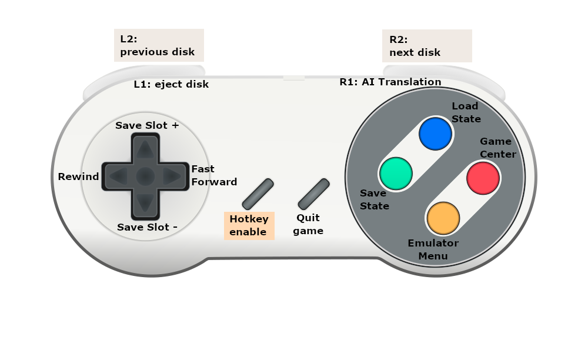
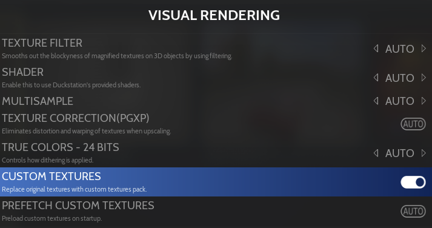

# Hotkeys

Hotkeys are controller or keyboard shortcuts, that are used to perform several operations while in-game, such as saving game progress (savestate), pausing the game or rewinding,  the more frequent usage will be to quit games/emulators by pressing **HOTKEY** + **START**

The Retrobat team has defaulted keyboard and controller hotkeys for multiple emulators, the default hotkey buttons for Gamepad are the following:

<figure><figcaption></figcaption></figure>


To trigger a hotkey action, you need to press and hold the "Hotkey enable" button, then press the second button that corresponds to the action to perform.


<table><thead><tr><th width="212.5833740234375">Hotkeys (Gamepad)</th><th width="153">Keyboard key</th><th width="372.683349609375">Action</th></tr></thead><tbody><tr><td>Hotkey + </td><td>CTRL+F12</td><td><a href="game-center.md">Game Center</a></td></tr><tr><td>Hotkey + </td><td>F1</td><td>Emulator Menu (or Pause if emulator has no menu)</td></tr><tr><td>Hotkey + </td><td>F4</td><td>Load State</td></tr><tr><td>Hotkey + </td><td>F2</td><td>Save State</td></tr><tr><td>Hotkey + START</td><td>Esc</td><td>Quit emulator/game</td></tr><tr><td>Hotkey + L1</td><td>F11</td><td>Eject Disc</td></tr><tr><td>Hotkey + R1</td><td></td><td>AI Translation Service</td></tr><tr><td>Hotkey + L2</td><td>F9</td><td>Select Disc Index -</td></tr><tr><td>Hotkey + R2</td><td>F10</td><td>Select Disc Index +</td></tr><tr><td>Hotkey + D-PAD UP</td><td>F7</td><td>Select Save Slot Index +</td></tr><tr><td>Hotkey + D-PAD DOWN</td><td>F6</td><td>Select Save Slot Index -</td></tr><tr><td>Hotkey + D-PAD LEFT</td><td>Backspace</td><td>Rewind</td></tr><tr><td>Hotkey + D-PAD RIGHT</td><td>Hold: F Toggle: Space</td><td>Fast Forward (can be changed from Hold to Toggle)</td></tr><tr><td>Hotkey + R3 (right stick)</td><td>F8</td><td>Screenshot</td></tr><tr><td></td><td>F</td><td>Toggle fullscreen</td></tr><tr><td></td><td>K</td><td>Frame Advance</td></tr><tr><td></td><td>P</td><td>Pause</td></tr></tbody></table>

The following list of emulators are currently aligned on this shortcut model, with some variations based on emulator capabilities:

Emulators with aligned hotkeys

* RetroArch
* Ares (uses PadToKey)
* BigPEmu
* Bizhawk (uses padToKey)
* Cgenius (only save/load state) (uses Pad2Key)
* Citron
* Demul
* DesMume (uses Pad2Key)
* Dhewm3
* Dolphin
* Duckstation
* Eden
* Flycast
* Hatari
* Jgenesis (uses Pad2Key)
* MAME
* Mednafen
* MelonDS (uses Pad2Key)
* Mesen
* Mupen64(RMG)
* OpenMSX
* PCSX2
* PPSSPP
* Project64 (uses Pad2Key)
* Raine (uses Pad2Key)
* Snes9X (uses Pad2Key)
* Sudachi
* Suyu
* Yuzu

## Customizing hotkeys

RetroBat offers the ability to modify the default hotkeys assignment for several emulators, both for keyboard and gamepad.

Modifications need to be performed inside a file located in the `\system\resources\inputmapping` folder of your RetroBat installation:

* **kb\_hotkeys.yml** : to modify standard assignment for keyboard
* **controller\_hotkeys.yml** : to modify standard assignment for controller hotkeys


It is also possible to modify hotkeys only for one emulator, this can be achieved by prefixing the file with the emulator name, for example "`pcsx2_controller_hotkeys.yml`".


The following list of emulators allow modification of hotkeys:

Emulators with assignable hotkeys

* RetroArch
* Ares
* BigPEmu
* Bizhawk
* DesMUME
* Dolphin
* Duckstation
* Flycast
* JGenesis
* Mednafen
* MelonDS
* Mesen
* PCSX2
* PPSSPP
* Project64
* Raine
* Snes9X


The file uses the RetroArch naming for hotkeys, even for other emulators.


### Remap controller hotkeys 

Copy the file **controller\_hotkeys.yml** to the `\user\inputmapping\` folder of your RetroBat installation.

Open the file with your preferred text editor:

<figure><figcaption></figcaption></figure>

The file is a yml-formatted file, **by default all values are commented**.

The first thing to do is to uncomment the actual section where the buttons are defined, as well as the container section, this is done by removing the # character on all lines after the `#default:` line, including the latter:

<figure><figcaption></figcaption></figure>

In this example, we will replace the **fast-forward** and **rewind** hotkeys with R1 and L1 buttons, and move the **disk\_eject** and **ai\_service** to the d-pad:

to do this, just assign the **rewind** feature to pageup (L1) and the **hold\_fast\_forward** to pagedown (R1), and then assign the **disk\_eject\_toggle** and **ai\_service** to their respective d-pad buttons (left & right):

<figure><figcaption></figcaption></figure>

Now save the file in the `\user\inputmapping` folder of your RetroBat installation:

<figure><figcaption></figcaption></figure>

In addition, it is also possible to perform a specific hotkey mapping for a specific core (in case emulators have multiple cores: Ares, Bizhawk, RetroArch...), in this example, the mapping is different between the flycast core, by using toggle instead of hold for fast forward:

<figure><figcaption></figcaption></figure>

### Remap keyboard hotkeys 

Copy the file **kb\_hotkeys.yml** to the `\user\inputmapping\` folder of your RetroBat installation.

Open the file with your preferred text editor:

<figure><figcaption></figcaption></figure>

The file is a yml-formatted file, **by default all values are commented**.

The first thing to do is to uncomment the actual section where the buttons are defined, as well as the container section, this is done by removing the # character on all lines after the `#default:` line, including the latter:

<figure><figcaption></figcaption></figure>

Now save the file:

<figure><figcaption></figcaption></figure>

In addition, it is also possible to perform a specific hotkey mapping for a specific core (in case emulators have multiple cores: Ares, Bizhawk, RetroArch...), in this example, the mapping is different between the flycast core, by using toggle instead of hold for fast forward:

<figure><figcaption></figcaption></figure>

