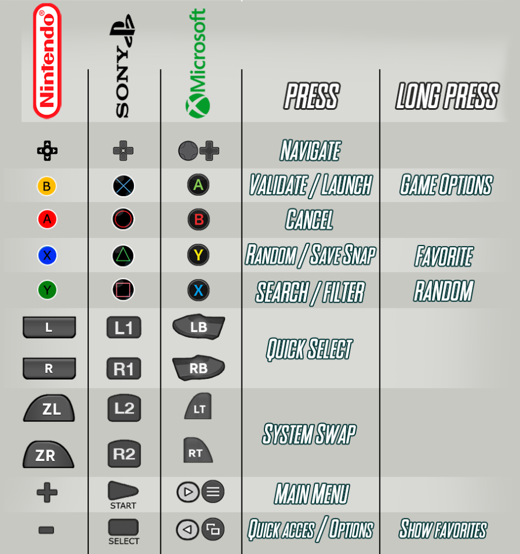

# Navigation Keys

You can navigate Retrobat using your controller or your keyboard.

A detailed pdf notice can be found [here](http://retrobat.ovh/notice/notice.pdf).

### **Controller navigation keys**

<figure><figcaption></figcaption></figure>

### **Keyboard navigation keys**

<figure><figcaption></figcaption></figure>
