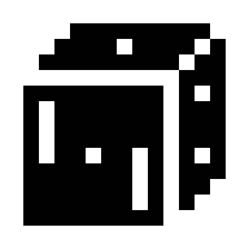
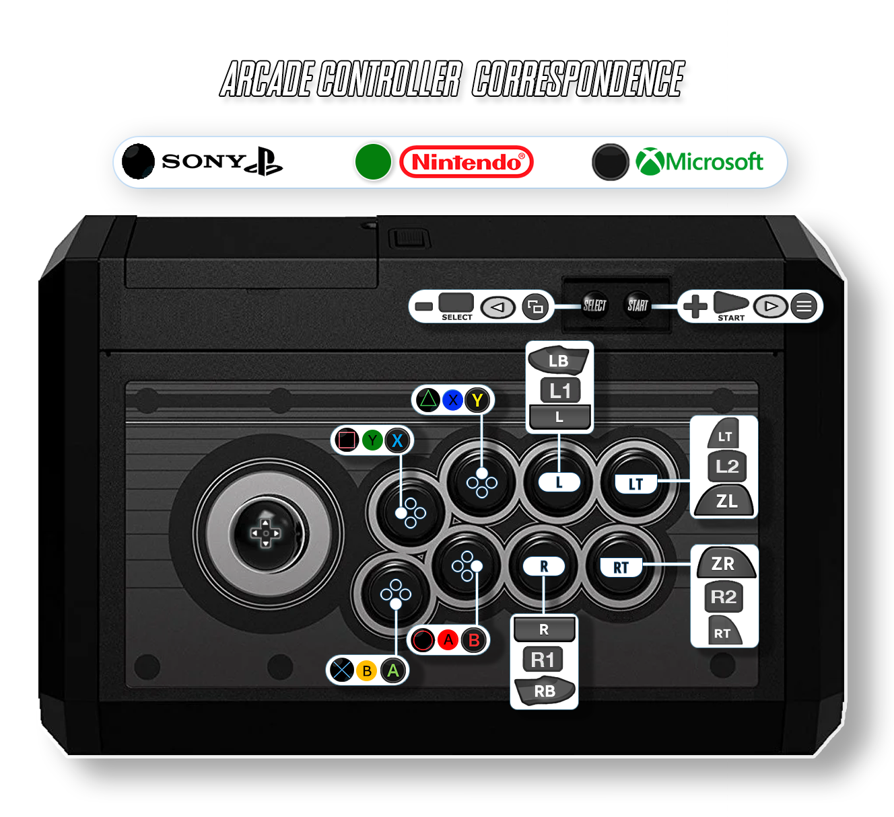

# Dice

<figure><figcaption></figcaption></figure>

Arcade

List of Dice games:



## Information

<table data-header-hidden><thead><tr><th width="224"></th><th></th></tr></thead><tbody><tr><td><strong>Emulators</strong></td><td><ul><li>Libretro: DICE</li></ul></td></tr><tr><td><strong>File folder</strong></td><td>📂 roms \ 📂 dice</td></tr><tr><td><strong>File extension</strong></td><td>.zip .dmy</td></tr></tbody></table>

## System Features

<table><thead><tr><th width="245">Retroachievements</th><th width="200">Netplay</th><th>Controller autoconfig</th></tr></thead><tbody><tr><td>lr-dice : NO</td><td>lr-dice : NO</td><td>lr-dice : YES</td></tr></tbody></table>

## Bios Information

No BIOS required to play DICE games. 

## Controls

### Arcade stick mapping

Mapping can be found in the [notice](http://retrobat.ovh/notice/notice.pdf).

<figure><figcaption></figcaption></figure>

### Controller mapping

| Retrobat Button                                | Arcade Key |
| ---------------------------------------------- | ---------- |
| START                                          | START      |
| SELECT                                         | COIN       |
| Left analog stick                              | Stick      |
| Right analog stick                             |            |
| D-PAD                                          | Stick      |
| .png>) | 3          |
| .png>) | 1          |
| .png>) | 2          |
| .png>) |            |
| L1                                             | Dollar     |
| R1                                             |            |
| L2                                             |            |
| R2                                             |            |
| L3                                             |            |
| R3                                             |            |

## Specific system information

### Adding DICE games

Some games use zipped ROMs and launch similarly to MAME or FBNeo --- filename is important, [see table](https://docs.libretro.com/library/dice/#compatibility).

Some games (pong, breakout, pinpong, etc) do not have any ROM on the board at all. For these, copy the dummy launcher file from [dummy\_files](https://github.com/mittonk/dice-libretro/tree/main/dummy_files) to your ROM folder.
