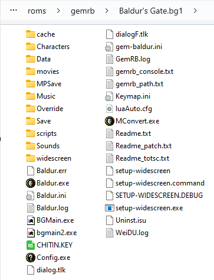
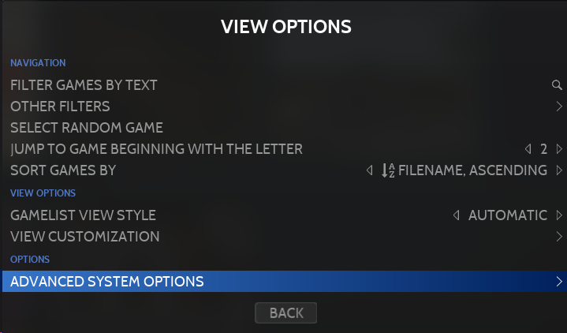
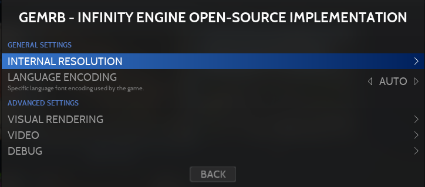
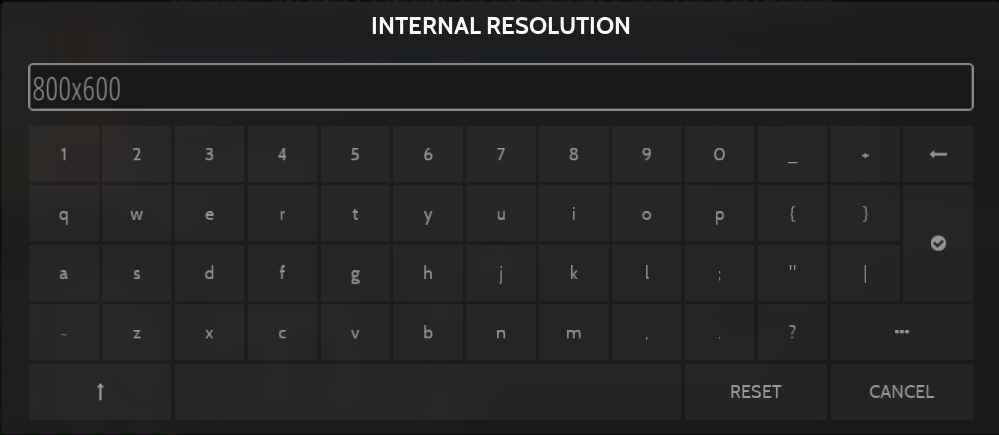
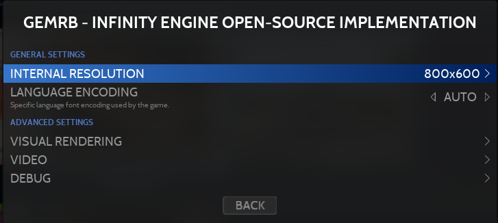
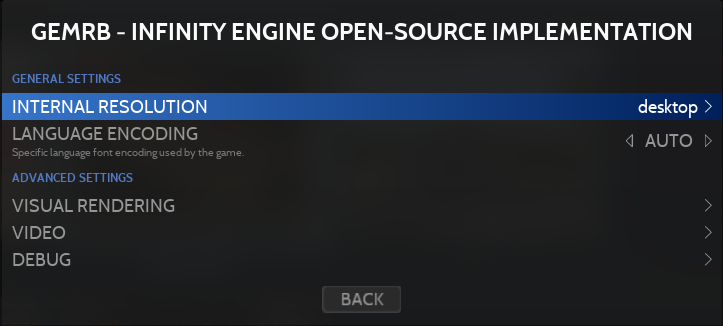

# GemRB

<figure><picture><source srcset="../../../.gitbook/assets/gemrb.png" media="(prefers-color-scheme: dark)"></picture><figcaption></figcaption></figure>

GemRB - Infinity Engine Open-Source Implementation



## Information

<table data-header-hidden><thead><tr><th width="184"></th><th></th><th data-hidden></th></tr></thead><tbody><tr><td><strong>Emulators</strong></td><td><ul><li>gemrb</li></ul></td><td></td></tr><tr><td><strong>Games Location</strong></td><td>📂roms \ 📂 gemrb</td><td></td></tr><tr><td><strong>File extensions</strong></td><td>.auto .bg1 .bg2 .how .iwd .iwd2 .pst</td><td></td></tr></tbody></table>

## BIOS information

No BIOS required

## Controls

Controls are managed in-game.&#x20;

GemRB / Infinity Engine games are designed for mouse and keyboard controls.&#x20;

Touchscreens are compatible as mouse-replacement.&#x20;

The gameplay consists of point and click actions and shortcut keys, like the most of C-RPG and RTS games.

## Specific system information

GemRB is an open-source implementation of the Bioware's Infinity Engine. It runs Baldur's Gate, Icewind Dale and Planescape Torment games, their expansions, sequels and mods.

GemRB is in heavy development since more than 20 years, a lot of effort has been put for games compatibility though it is not yet perfect.

Here is a table showing compatibility status:

<table><thead><tr><th width="253">Games</th><th width="159" align="center">Playable</th><th width="157" align="center">Completable</th><th align="center">Polished</th></tr></thead><tbody><tr><td>Baldur's Gate</td><td align="center">YES</td><td align="center">YES</td><td align="center">YES</td></tr><tr><td>Baldur's Gate II</td><td align="center">YES</td><td align="center">YES</td><td align="center">YES</td></tr><tr><td>Icewind Dale</td><td align="center">YES</td><td align="center">YES</td><td align="center">YES</td></tr><tr><td>Icewind Dale II</td><td align="center">YES</td><td align="center"><mark style="color:red;">NO</mark></td><td align="center"><mark style="color:red;">NO</mark></td></tr><tr><td>Planescape Torment</td><td align="center">YES</td><td align="center">YES</td><td align="center"><mark style="color:red;">NO</mark></td></tr><tr><td>Any Enhanced Edition</td><td align="center"><mark style="color:red;">NO</mark></td><td align="center"><mark style="color:red;">NO</mark></td><td align="center"><mark style="color:red;">NO</mark></td></tr><tr><td>New games</td><td align="center"><mark style="color:red;">NO</mark></td><td align="center"><mark style="color:red;">NO</mark></td><td align="center"><mark style="color:red;">NO</mark></td></tr></tbody></table>

### Adding GemRB games

GemRB needs the original game files published by Bioware and Black Isle. It is not yet compatible with the Enhanced Editions by Beamdog.&#x20;

For each games, you need to create a folder where all the files of the game need to be copied.

&#x20;The folder name must contain an extension that identifies the game type you want to run and each game has its own identifier:&#x20;

<table><thead><tr><th width="474">Games</th><th align="center">Identifiers</th></tr></thead><tbody><tr><td>Baldur's Gate +/- Tales of the Sword Coast</td><td align="center">bg1</td></tr><tr><td>Baldur's Gate II - Shadows of Amn +/- Throne of Bhaal</td><td align="center">bg2</td></tr><tr><td>Icewind Dale (without any extension)</td><td align="center">iwd</td></tr><tr><td>Icewind Dale - Heart of Winter +/- Trial of the Luremaster</td><td align="center">how</td></tr><tr><td>Icewind Dale II</td><td align="center">iwd2</td></tr><tr><td>Planescape Torment</td><td align="center">pst</td></tr><tr><td>To try game autodetection</td><td align="center">auto</td></tr></tbody></table>

For example for the game Baldur's Gate:

<figure><figcaption>
Example of GemRB game folder
</figcaption></figure>

### Change game resolution

Without any widescreen mod installed, games are only compatible with their native resolution(s).

Here is the native resolutions compatibility list:

<table data-header-hidden><thead><tr><th width="329">Games</th><th>Native resolutions</th></tr></thead><tbody><tr><td>Baldur's Gate +/- Tales of the Sword Coast</td><td>640x480</td></tr><tr><td>Baldur's Gate II - Shadows of Amn +/- Throne of Bhaal</td><td>640x480 / 800x600 / 1024x768 / 1280x960</td></tr><tr><td>Icewind Dale (without any extension)</td><td>640x480</td></tr><tr><td>Icewind Dale - Heart of Winter +/- Trial of the Luremaster</td><td>640x480 / 800x600 / 1024x768 / 1280x960</td></tr><tr><td>Icewind Dale II</td><td>800x600 / 1024x768 / 1280x960</td></tr><tr><td>Planescape Torment</td><td>640x480</td></tr></tbody></table>

To change the game resolution you need to edit the **Internal Resolution** option in RetroBat:

<figure><figcaption></figcaption></figure>

<figure><figcaption></figcaption></figure>

Unlike usual, you will need here to manually type the compatible resolution you want for your game, for example 800x600 in the edit box, then validate it:

<figure><figcaption></figcaption></figure>

<figure><figcaption></figcaption></figure>

If you leave the edit box empty, it will default to the lower game's native resolution.

### Widescreen Mod

For a more modern widescreen resolution you will need to apply a widescreen patch to your game. Depending on the game, it may require also additional mods for the game interface to fit the screen.

You can download the widescreen mods [here](https://www.gibberlings3.net/mods/tools/widescreen/).

Follow the instruction of the mod then repeat the step above to change the resolution to the one you specified when applying the widescreen mod.


If this resolution is the same than your desktop's, simply type "desktop" instead of the full resolution.


<figure><figcaption></figcaption></figure>

