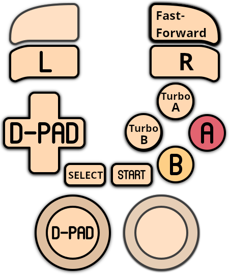
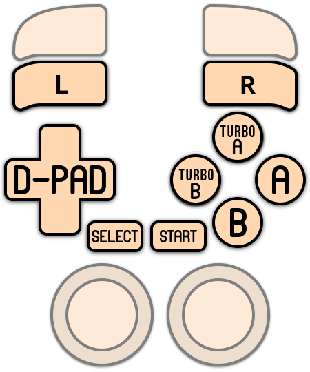

# Game Boy Advance

<figure><figcaption></figcaption></figure>

Portable Game Console - Lifespan: 2001 - 2008



## Information

<table data-header-hidden><thead><tr><th width="184"></th><th></th><th data-hidden></th></tr></thead><tbody><tr><td><strong>Emulators</strong></td><td><ul><li>libretro: mgba</li><li>libretro: mednafen_gba</li><li>libretro: gpsp</li><li>mgba</li><li>no$gba</li><li>mednafen</li><li>ares</li><li>bizhawk: mGBA</li><li>jgenesis</li><li>mesen</li></ul></td><td></td></tr><tr><td><strong>Games Location</strong></td><td>📁 roms \ 📂 gba</td><td></td></tr><tr><td><strong>File extensions</strong></td><td>.gba .zip .7z</td><td></td></tr></tbody></table>

## System Features

<table><thead><tr><th width="256">Retroachievements</th><th width="243">Netplay</th><th>Controller autoconfig</th></tr></thead><tbody><tr><td>lr-mgba: YES lr-mednafen: YES lr-gpsp: YES mGBA: NO no$gba: NO Mednafen: NO Ares: NO BizHawk: YES JGenesis: NO Mesen: NO</td><td>lr-mgba: YES lr-mednafen: YES lr-gpsp: YES mGBA: NO no$gba: NO Mednafen: NO Ares: NO BizHawk: NO JGenesis: NO Mesen: NO</td><td>lr-mgba: YES lr-mednafen: YES lr-gpsp: YES mGBA: YES no$gba: NO Mednafen: YES Ares: YES BizHawk: YES JGenesis: YES Mesen: YES</td></tr></tbody></table>

## BIOS

<table><thead><tr><th width="187">Bios file</th><th width="108">Folder</th><th>md5</th></tr></thead><tbody><tr><td>gba_bios.bin</td><td><code>\bios</code></td><td>a860e8c0b6d573d191e4ec7db1b1e4f6</td></tr></tbody></table>

## Controls

| Option / emulator                                                              | Control Layout                                                                                                                         |
| ------------------------------------------------------------------------------ | -------------------------------------------------------------------------------------------------------------------------------------- |
| 
lr-mgba Mesen
                                                        |  |
| lr-mednafen\_gba                                                               |  |
| 
 - Ares - Bizhawk (option to enable turbo is available) - mGBA
 |        |
| lr-gpsp                                                                        |                                                        |
| Mednafen standalone                                                            | 

                                    |

Some cores and emulators offer option to invert face buttons and to enable rumble, the option can be found in **ADVANCED SETTINGS > CONTROLS**:

<figure><figcaption></figcaption></figure>

## Specific system information

There is no specific System information documented here yet.
