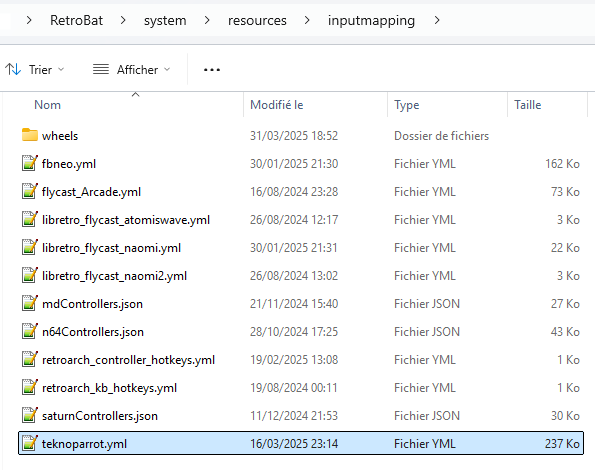
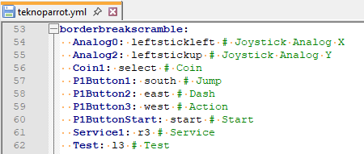
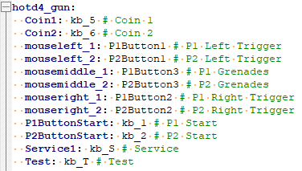

# Configuration des touches Teknoparrot

Il existe de nombreux types de jeu sous Teknoparrot, et il est difficile d'adapter une configuration commune a toutes les variantes de jeu, qu'ils soient de type racing, de tir ou autre. il peut être également difficile de reproduire le gameplay caractéristique de certaines versions arcade. Aussi, si la configuration que nous vous avons préparé par défaut ne vous convient pas, ou ne fonctionne pas avec le contrôleur que vous utilisez, vous pourrez personnalisez les contrôles pour chaque jeu.

Voilà comment procéder.

## Emplacement des fichiers de configuration

Par défaut, depuis la version 7 de RetroBat, il existe une configuration de base ajoutée pour la grande majorité des jeux Teknoparrot disponibles (hors Patreon). Cette configuration se trouve dans le fichier `\system\resources\inputmapping\teknoparrot.yml`&#x20;

<figure><figcaption></figcaption></figure>

Le contenu de ce fichier doit respecter une mise en page particulière pour assurer son fonctionnement.\
Il contient tout d'abord :&#x20;

* le nom du gameprofil.xml correspondant au jeu : le container.\
  Le container doit être nommé exactement comme le fichier de configuration correspondant, qui se trouve dans `\emulators\teknoparrot\GameProfiles\` . Il doit être saisi en minuscule (et sans l'extension),
* s'en suit, dans l'ordre et "par colonne" :&#x20;
  * la valeur présente dans le gameprofil, entre les balises \<InputMapping>
  * le bouton qui effectue l'action sur le contrôleur
  * l'action correspondante dans le jeu\

<figure><figcaption></figcaption></figure>

Chaque ligne reprend ainsi toutes les valeurs InputMapping présente dans le gameprofil.

## Modifications des touches

Vous pouvez également adapter les touches en fonction de vos envies. \
La liste des valeurs qu'il est possible de renseigner pour le contrôleur sont :\
r3, l3, select, start, righttrigger, lefttrigger, rightshoulder, leftshoulder, south, east, west, north, up, down, left, right, leftstickleft, leftstickright, leftstickup, leftstickdown, rightstickleft, rightstickright, rightstickup, rightstickdown

Il est également possible de créer un paramétrage spécifique si vous utilisez un lightgun. Pour cela, il suffit de refaire l'opération, mais en rajoutant `_gun` au nom du container.

Pour les jeux au pistolet, ils ont souvent 3 boutons reconnus comme des actions à la souris. \
Pour renseigner ce type d'action, vous devez inverser l'ordre de saisie, et utiliser la liste des boutons ci-dessous à la place de la valeur présente entre les balises InputMapping :\
mouseleft, mousemiddle, mouseright, button4, button5

Ce qui donne, en prenant l'exemple de hotd4 :&#x20;

<figure><figcaption></figcaption></figure>

Les autres boutons pour les lightguns sont habituellement identifiés comme des touches de clavier. Dans ce cas, utilisez les valeurs suivantes : \
kb\_x ou x équivaut à la touche du clavier\
kb\_dy ou y équivaut à un nombre du clavier
