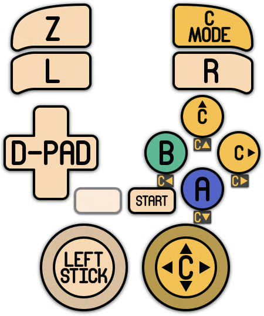

# 🎮 Manettes de Jeu

Toutes les manettes de jeu détectées par Windows sont généralement compatibles avec Retrobat.

Les manettes filaires sont "Plug'n'Play", elles peuvent être configurées dans Retrobat dès la connexion.

Les manettes de jeu Bluetooth doivent au préalable être appairées avec Windows pour pouvoir fonctionner.


Il est possible de tester une manette de jeu [ICI ](https://gamepad-tester.com/)pour vérifier son bon fonctionnement avec Windows.


### Manettes 8bitdo 

.png>)

Les manettes de jeu 8bitdo fonctionnent parfaitement avec Windows et Retrobat.

Il est possible de configurer les manettes 8bitdo de 2 manières : XINPUT ou sdl, il est recommandé de les paramétrer en XInput pour une meilleure compatibilité.

Sur les anciens modèles, le mode XINPUT est activé en maintenant les boutons `START` + `X` lors de la mise en route du contrôleur. (`START`+ `Y` pour le mode SLD).

Sur les modèles plus récents, le passage d'un mode à l'autre s'effectue à l'arrière du contrôleur.


Le gyroscope intégré aux manettes n'est pas utilisable en XInput. Utiliser le mode sdl (switch) si la fonctionnalité gyroscope est nécessaire.


Pour les manettes filaires, le passage de XInput à sdl s'effectue en maintenant `X` ou`Y` en branchant le câble USB.

### Manettes XBox (ou tout autre contrôleur XInput)

.png>)

Les manettes filaires sont plug'n'play.

Les manettes Bluetooth, une fois appairées avec Windows, fonctionnent également parfaitement avec Retrobat.

Les modèles de manettes produits avant le modèle Xbox One S (par exemple Xbox 360, Xbox One) nécessitent l'utilisation d'un dongle USB spécifique pour fonctionner.

### Manette Nintendo Switch Pro

.png>)

La manette Switch Pro est idéale pour les émulateurs CEMU (WiiU) ou Yuzu (Switch),étant nativement reconnue par ces derniers. De plus la fonctionnalité gyroscope sera reconnue automatiquement par ces émulateurs.

### Manette Playstation 5 (DualSense)

.png>)

La manette DualSense est compatible avec la fonctionnalité gyroscope et fonctionne nativement avec Retrobat.

### Manette Playstation 4 (DualShock 4)

.png>)

La manette DS4 est compatible avec la fonctionnalité gyroscope et fonctionne nativement avec Retrobat.
