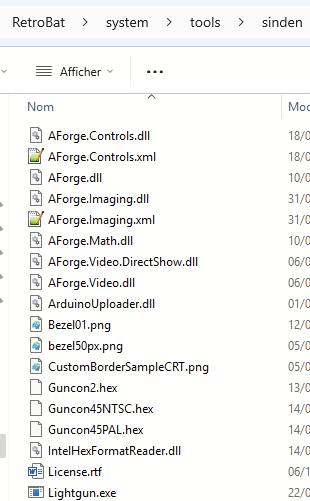
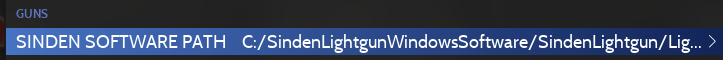
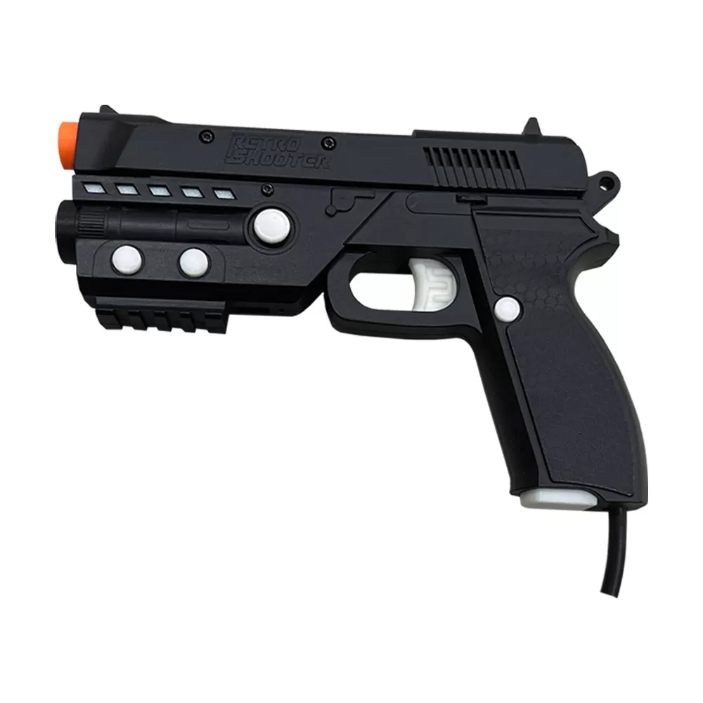

# 🔫 Pistolets

La comptabilité avec les pistolets est une fonctionnalité assez récente dans Retrobat, pour une utilisation correcte sur certains émulateurs (Model2, Model3, Teknoparrot, ...), il sera nécessaire d'effectuer des réglages directement dans les émulateurs.

Il existe plusieurs modèles de pistolets sur le marché, seuls quelques-uns ont pu être testé par les équipes .

## Détection du pistolet

Lorsqu'un pistolet est connecté, une icône représentant un pistolet apparaît dans le coin supérieur gauche de l'écran, à l'emplacement des icônes des manettes :  (1).png>)

Une cible est également visible à l'écran, et une nouvelle collection "JEUX DE TIR" est disponible dans la **Vue Système**

<figure><figcaption></figcaption></figure>

Les jeux de tir sont identifiés à l'aide d'une icône "pistolet" apparaissant après leur nom.

<figure><figcaption>
Duck Hunt est compatible
</figcaption></figure>

La liste des jeux compatibles est maintenue dans un fichier .xml localisé dans le répertoire d'installation de Retrobat. Il est possible de modifier la liste directement dans le fichier xml si des jeux sont manquants ou identifiés par erreur.


L'équipe RetroBat ne recommande pas de modifier ce fichier.\
Conserver une version du fichier modifié afin d'éviter de le perdre lors d'une mise à jour de Retrobat.


<figure><figcaption>
le fichier gungames.xml
</figcaption></figure>


Certains jeux listés ne sont pas des jeux jouables entièrement au pistolet, il est possible que la fonctionnalité soit réduite à un mini-jeu ou à un seul niveau du jeu.


## Configuration des pistolets

### Activation

Les pistolets peuvent être activé dans les fonctionnalités avancées du système ou dans les fonctionnalités avancées du jeu.

Depuis la **Vue Jeux** ouvrir les [**options d'affichage**](../../../navigation/view-options.md) et sélectionner **CONFIGURATION AVANCÉE DU SYSTEME**

<figure><figcaption></figcaption></figure>

Choisir ensuite **PISTOLETS**

<figure><figcaption></figcaption></figure>

Puis activer l'option **PISTOLETS**

<figure><figcaption></figcaption></figure>

Le même paramétrage peut être effectué individuellement pour un jeu dans le menu [Options du Jeu](../../../navigation/game-options.md#configuration-avancee-du-jeu) puis **CONFIGURATION AVANCÉE DU JEU**.


L'option peut être nommée différemment en fonction des systèmes.


## Modèles de pistolets

### WiiMote & Mayflash DolphinBar

.png>) (1).png>)

Il est possible de profiter de ses jeux de tirs avec une Wiimote associée à une Mayflash Dolphinbar.

2 options de configuration sont disponibles:

* Mayflash Dolphinbar en mode 2
* Mayflash Dolphinbar en mode 4 et activation de [WiimoteGun](wiimotegun.md).


Le processus d'installation de la Mayflash Dolphinbar n'est pas détaillée dans ce wiki, suivre les instructions disponibles sur le site Web [Mayflash](https://www.mayflash.com/product/6.html).


Les 2 configurations fonctionnent sur un même principe : convertir les mouvements de la wiimote en mouvement simulant le pointeur d'une souris. Les émulateurs permettant la visée à l'aide d'une souris pourront ainsi être contrôlé par la Wiimote.

Le paramétrage de la Dolphinbar en mode 4 permet l'utilisation de l'utilitaire [WiimoteGun](wiimotegun.md), et donc de la calibration de la Wiimote en maintenant appuyé le bouton "home" de la Wiimote.


Afin d'améliorer la précision des Wiimotes, il est recommandé de positionner la Dolphinbar sous l'écran, le plus près possible de celui-ci. (penser à positionner le switch à l'arrière de la DolphinBar en position BOTTOM).



Le mode 4 de la DolphinBar simule le mode natif de la Wii et est pris en charge nativement par l'émulateur Dolphin. Il est donc possible d'avoir une expérience de jeu similaire au jeu sur une console Wii  en utilisant l'émulateur Dolphin, une Mayflash Dolphinbar et en sélectionnant l'option WIIMOTE TYPE = REAL dans les options avancées du système Wii.



Précision: le mode 4 de la dolphinbar n'est pas compatible avec l'utilisation de plusieurs wiimotes dans le cadre de jeux "multigun".


### Sinden Lightgun

<figure><figcaption></figcaption></figure>

Le Sinden Lightgun fonctionne et est détecté par RetroBat, il est cependant nécessaire que le logiciel Sinden soit en cours d'exécution:



Lors de l'utilisation d'un Sinden Lightgun, il est nécessaire de faire apparaître une bordure blanche autour de l'écran. Cette bordure permet à la caméra du pistolet de détecter la cible.

* La bordure apparaît automatiquement dans la plupart des cas
* Pour certains émulateurs "standalones", il est possible de faire apparaître la bordure à l'aide de Reshade, en sélectionnant le shader "sindenborder" dans la liste de shaders disponibles

<figure><figcaption></figcaption></figure>

RetroBat peut lancer automatiquement le logiciel Sinden Lightgun quand un pistolet Sinden est détecté, vous pouvez également l'ajouter dans le dossier **system\tools\sinden** de votre installation Retrobat...&#x20;

<figure><figcaption></figcaption></figure>

...ou spécifier où trouver le logiciel depuis les réglages :

<figure><figcaption></figcaption></figure>

Il est important de s'assurer que le logiciel Sinden est configuré pour démarrer automatiquement :&#x20;

<figure><figcaption></figcaption></figure>

## Gun4IR



## RetroShooters 

<figure><figcaption></figcaption></figure>


