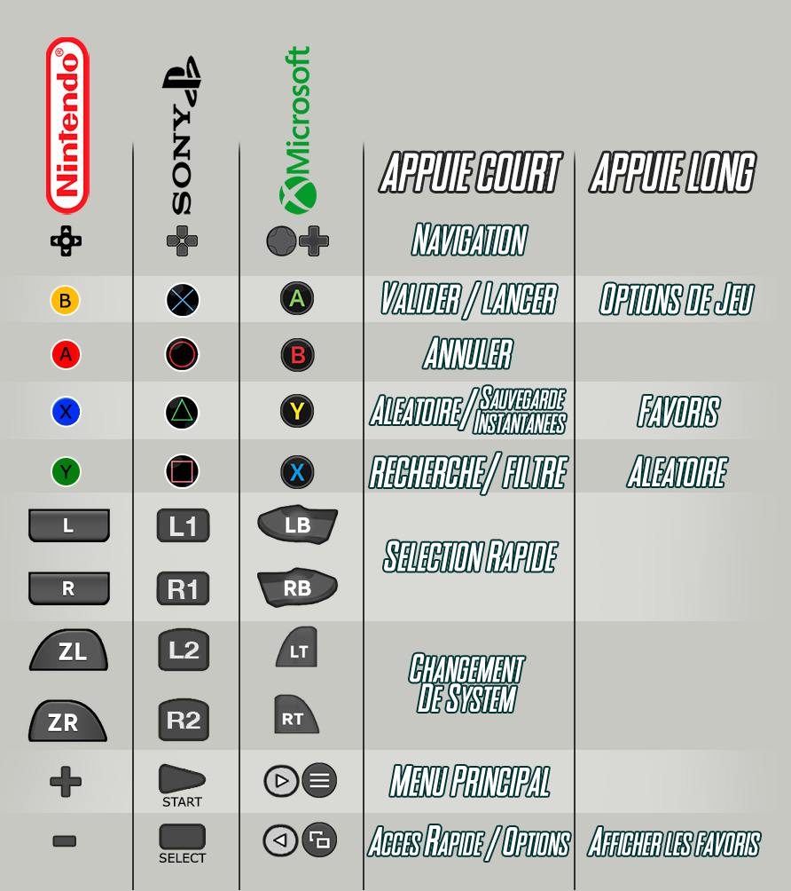
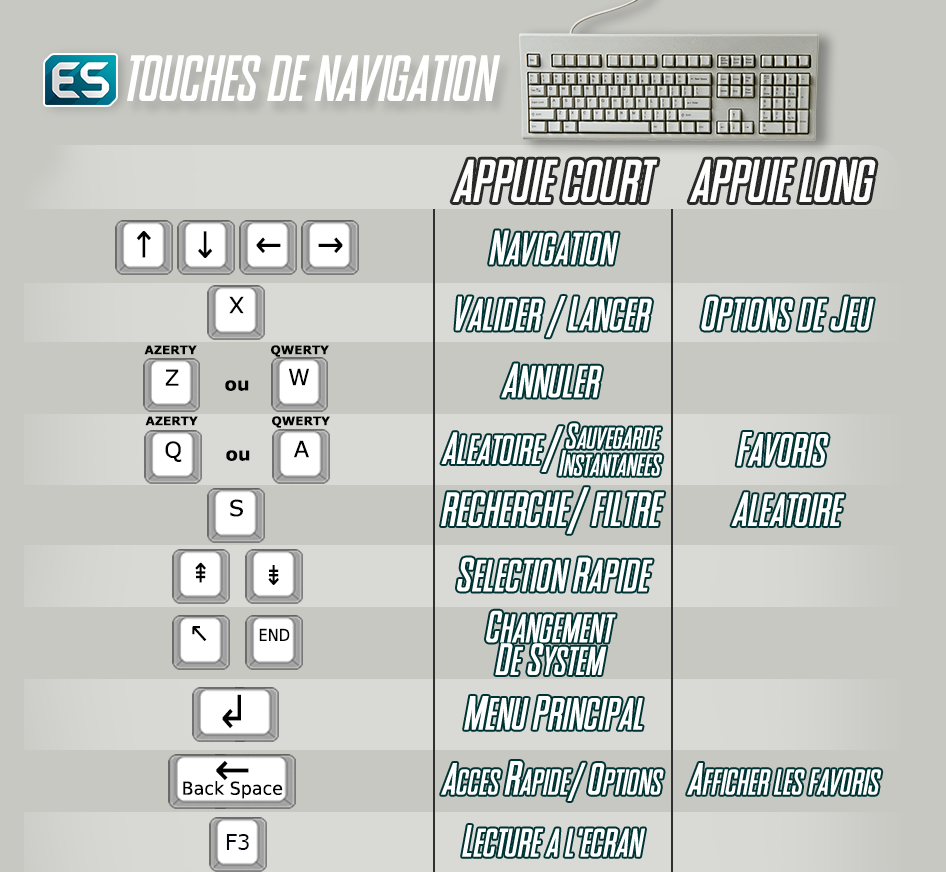

# Navigation

Il est possible de naviguer dans les écrans et menu en utilisant une manette de jeu ou un clavier.

Au notice détaillée au format pdf est disponible [ici](http://retrobat.ovh/notice/notice.pdf).

### **Navigation avec une manette de jeu**

<figure><figcaption></figcaption></figure>

### **Navigation au clavier**

<figure><figcaption></figcaption></figure>
