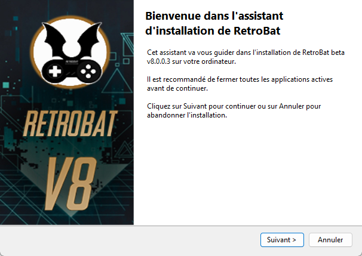
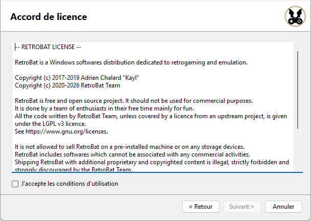
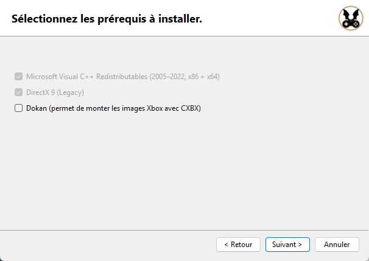
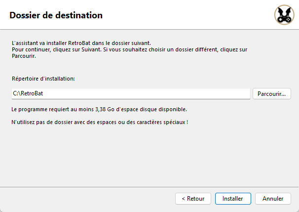
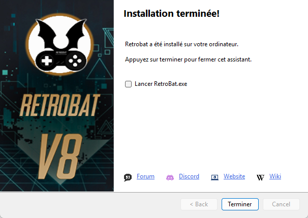
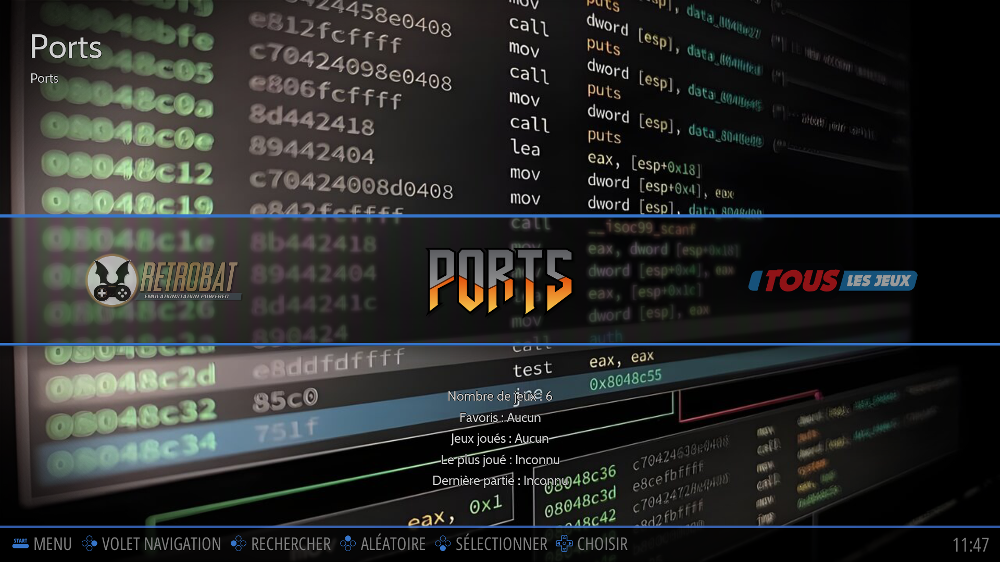

# Installation & Premier démarrage

## Installation

* Télécharger la dernière version de l'installeur sur le [site web Retrobat](https://www.retrobat.org/telechargement/).
* Exécuter le programme d'installation.

<figure><figcaption></figcaption></figure>

* Accepter la licence utilisateur

<figure><figcaption></figcaption></figure>

* Sélectionner les prérequis manquants à installer


RetroBat détectera automatiquement si ces fichiers sont déjà installés. Si c'est le cas, cette page n’apparaîtra pas.


<figure><figcaption></figcaption></figure>

* Sélectionner le dossier d'installation et cliquer sur **Installer**.


Attention: un dossier d'installation trop long (ou dans trop de sous-dossiers) peut poser des problèmes pour certains émulateurs comme libretro:mame.

Ne pas sélectionner de dossier contenant des espaces ou des caractères spéciaux.


<figure><figcaption></figcaption></figure>

* Attendre la fin de l'installation, puis cliquer **Terminer**.

<figure><figcaption></figcaption></figure>

Le dossier de RetroBat est créé avec la structure suivante:

<figure><figcaption></figcaption></figure>

## Premier démarrage

Lancer le fichier `RetroBat.exe` ou utiliser le raccourci bureau.

Après une courte vidéo d'intro, la **Vue Système** est affichée.

<figure><figcaption></figcaption></figure>


Retrobat détecte la langue de l'OS au premier lancement.&#x20;

Les langues suivantes sont reconnues: anglais, français, japonais, espagnol, allemand, italien, néerlandais, portuguais, russe, coréen, chinois, polonais, arabe


Dans la **Vue Système**, la navigation s'effectue à l'aide d'un clavier ou d'une manette de jeu.

Pour une utilisation avec une manette de jeu, si RetroBat ne parvient pas à configurer automatiquement le contrôleur:

* Appuyer sur un bouton, l'écran **CONFIGURER LES MANETTES** apparaît

<figure><figcaption></figcaption></figure>

* Garder un bouton appuyé pour passer à l'écran **CONFIGURATION**.

<figure><figcaption></figcaption></figure>

* Configurer chaque bouton en fonction de la manette de jeu connectée.&#x20;


Utiliser le bouton **SELECT** comme hotkey.

