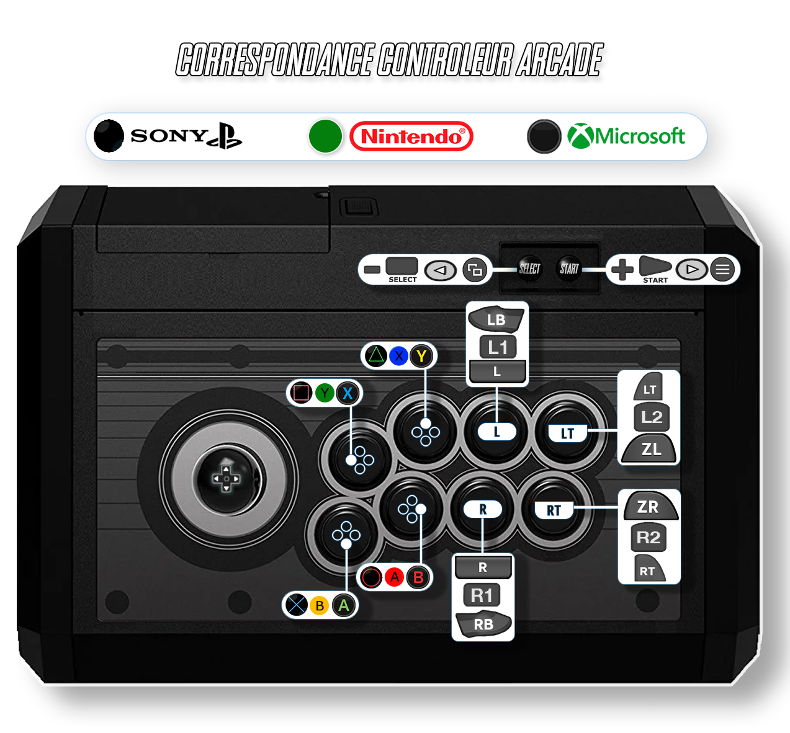

# Dice

<figure><figcaption></figcaption></figure>

Arcade

Liste des jeux Dice :



## Information

<table data-header-hidden><thead><tr><th width="224"></th><th></th></tr></thead><tbody><tr><td><strong>Émulateurs</strong></td><td><ul><li>Libretro : DICE</li></ul></td></tr><tr><td><strong>Dossier des jeux</strong></td><td>📂 roms \ 📂 dice</td></tr><tr><td><strong>Extensions</strong></td><td>.zip .dmy</td></tr></tbody></table>

## Fonctionnalités

<table><thead><tr><th width="245">Succès Rétro</th><th width="200">Parties en Réseau</th><th>Auto configuration des contrôles</th></tr></thead><tbody><tr><td>lr-dice : NON</td><td>lr-dice : NON</td><td>lr-dice : OUI</td></tr></tbody></table>

## Bios

Aucun BIOS nécessaire.

## Contrôles

### Stick Arcade

La correspondance des boutons est disponible dans la [notice](http://retrobat.ovh/notice/notice_fr.pdf).

<figure><figcaption></figcaption></figure>

### Manette de jeu

| Retrobat                                       | Arcade |
| ---------------------------------------------- | ------ |
| START                                          | START  |
| SELECT                                         | COIN   |
| Stick analogique gauche                        | Stick  |
| Stick analogique droit                         |        |
| D-PAD                                          | Stick  |
| .png>) | 3      |
| .png>) | 1      |
| .png>)  | 2      |
| .png>) |        |
| L1                                             | Dollar |
| R1                                             |        |
| L2                                             |        |
| R2                                             |        |
| L3                                             |        |
| R3                                             |        |

## Informations spécifiques au système

### Ajout des jeux DICE

Certains jeux utilisent des ROMS zippées et se lancent à l'identique des jeux MAME ou FBNeo.

Attention toutefois au nom des fichiers, qui doivent être identique à ceux indiqués [dans cette liste](https://docs.libretro.com/library/dice/#compatibility).

D'autres jeux en revanche (pong, breakout, pinpong, etc) ne nécessitent pas de ROM. Pour ces jeux, il suffit de copier les fichiers lanceurs [depuis cet emplacement](https://github.com/mittonk/dice-libretro/tree/main/dummy_files) vers votre dossier roms\dice.
