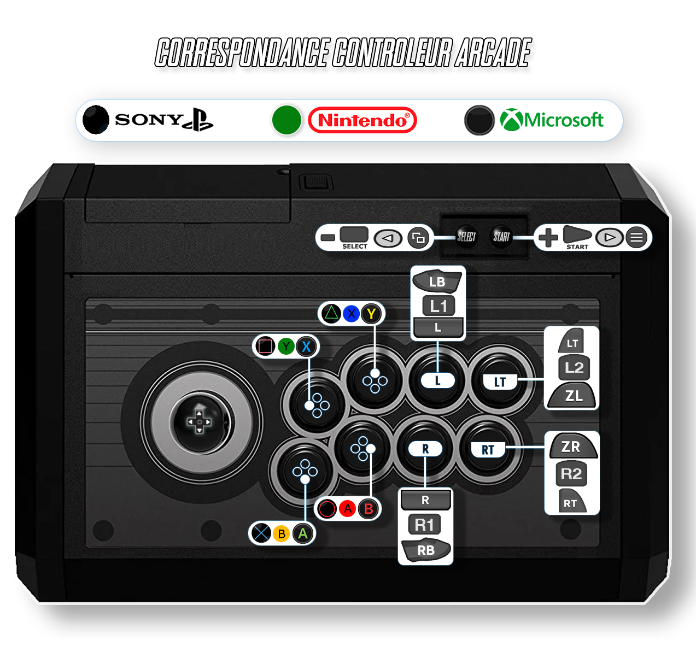

# Final Burn Neo

<figure><figcaption></figcaption></figure>

Arcade

## Information

<table data-header-hidden><thead><tr><th width="224"></th><th></th></tr></thead><tbody><tr><td><strong>Émulateurs</strong></td><td><ul><li>Libretro : fbneo</li><li>Libretro : fbalpha</li><li>Libretro : fbalpha2012</li><li>Libretro : fbalpha2012_neogeo</li><li>FBNeo</li></ul></td></tr><tr><td><strong>Dossier des jeux</strong></td><td>📂 roms \ 📂 fbneo</td></tr><tr><td><strong>Extensions</strong></td><td>.fba .zip .chd .7z .bin</td></tr></tbody></table>

## Fonctionnalités

| Succès Rétro                       | Parties en Réseau                  |
| ---------------------------------- | ---------------------------------- |
| 
libretro: OUI FBNeo: NON
 | 
libretro: OUI FBNeo: NON
 |

## Bios

Certains systèmes émulés par FBNeo nécessitent la présence de fichiers BIOS.

<table><thead><tr><th width="164">Fichiers BIOS</th><th width="153.03610108303252">Dossier</th><th>Utilisation</th></tr></thead><tbody><tr><td>neogeo.zip</td><td><code>\bios</code></td><td>Neo Geo BIOS</td></tr><tr><td>pgm.zip</td><td><code>\bios</code></td><td>PGM System BIOS</td></tr><tr><td>skns.zip</td><td><code>\bios</code></td><td>Super Kaneko Nova System BIOS</td></tr><tr><td>neocdz.zip</td><td><code>\bios</code></td><td>Neo Geo CD BIOS</td></tr><tr><td>decocass.zip</td><td><code>\bios</code></td><td>DECO Cassette System BIOS</td></tr><tr><td>isgsm.zip</td><td><code>\bios</code></td><td>ISG Selection Master Type 2006 System BIOS</td></tr><tr><td>midssio.zip</td><td><code>\bios</code></td><td>Midway SSIO Sound Board Internal ROM</td></tr><tr><td>nmk004.zip</td><td><code>\bios</code></td><td>NMK004 Internal ROM</td></tr><tr><td>ym2608.zip</td><td><code>\bios</code></td><td>YM2608 Internal ROM</td></tr><tr><td>cchip.zip</td><td><code>\bios</code></td><td>C-Chip Internal ROM</td></tr><tr><td>bubsys.zip</td><td><code>\bios</code></td><td>Bubble System BIOS</td></tr><tr><td>namcoc69.zip</td><td><code>\bios</code></td><td>Namco C69 BIOS</td></tr><tr><td>namcoc70.zip</td><td><code>\bios</code></td><td>Namco C70 BIOS</td></tr><tr><td>namcoc75.zip</td><td><code>\bios</code></td><td>Namco C75 BIOS</td></tr><tr><td>coleco.zip</td><td><code>\bios</code></td><td>ColecoVision System BIOS</td></tr><tr><td>fdsbios.zip</td><td><code>\bios</code></td><td>FDS System BIOS</td></tr><tr><td>msx.zip</td><td><code>\bios</code></td><td>MSX1 System BIOS</td></tr><tr><td>ngp.zip</td><td><code>\bios</code></td><td>NeoGeo Pocket BIOS</td></tr><tr><td>spectrum.zip</td><td><code>\bios</code></td><td>ZX Spectrum BIOS</td></tr><tr><td>spec128.zip</td><td><code>\bios</code></td><td>ZX Spectrum 128 BIOS</td></tr><tr><td>spec1282a.zip</td><td><code>\bios</code></td><td>ZX Spectrum 128 +2a BIOS</td></tr><tr><td>channelf.zip</td><td><code>\bios</code></td><td>Fairchild Channel F BIOS</td></tr></tbody></table>


Si vous utilisez le core libretro fbalpha2012\_neogeo core, placez les bios dans le dossier  `\roms\fbneo`.

Le core ne permet pas l'utilisation du dossier `\bios`.


## Dossiers FBNeo

**Roms**: \roms\fbneo

**Bios**: \bios or \bios

**Samples**: \bios\fbneo\samples

**Hiscore.dat**: \bios\fbneo

**Cheats**: \bios\fbneo\cheats

**Blend files**: \saves\fbneo\blend

## Contrôles

### Stick Arcade

La correspondance des boutons est disponible dans la [notice](http://retrobat.ovh/notice/notice.pdf).

<figure><figcaption></figcaption></figure>

### Manette de jeu

FBNEO offre le choix entre 2 schémas de contrôle:

* CLASSIC
* MODERN

| Retrobat                                           | CLASSIC | MODERN |
| -------------------------------------------------- | ------- | ------ |
| START                                              | START   | START  |
| SELECT                                             | COIN    | COIN   |
| Stick analogique gauche                            | Stick   | Stick  |
| Stick analogique droit                             |         |        |
| D-PAD                                              | Stick   | Stick  |
| .png>)     | 3       | 3      |
|  (1).png>) | 1       | 1      |
|  (1).png>)  | 2       | 2      |
| .png>)     | 4       | 4      |
| L1                                                 | 5       |        |
| R1                                                 | 6       | 5      |
| L2                                                 |         |        |
| R2                                                 |         | 6      |
| L3                                                 |         |        |
| R3                                                 |         |        |

### Contrôles pour l'émulateur FBNeo standalone

RetroBat permet une configuration des contrôles pour chaque jeu avec l'émulateur FBNEO.

Le fichier contenant les informations pour la configuration des contrôles est disponible dans le dossier `\system\resources\inputmapping`de votre installation RetroBat, il est nommé **fbneo.yml**

<figure><figcaption></figcaption></figure>

Une explication détaillée de l'utilisation de ce fichier est détaillée en commentaire dans la première partie du fichier.

Voici un exemple de configuration pour le(s) jeu(x) Street Fighter III

<figure><figcaption></figcaption></figure>

La section du fichier .yml est composée des éléments suivants:

<table><thead><tr><th width="208">Valeur</th><th>Description</th></tr></thead><tbody><tr><td>Nom du jeu</td><td>Doit être identique au nom du fichier .zip du jeu (ou aux premiers caractères du fichier du jeu).  (exemple. sfiii sera valide pour tous les fichiers de jeux commençant par sfiii, sauf si un mapping a été créé spécifiquement pour une variante du jeu, avec le nom exact du fichier de jeu)</td></tr><tr><td>Nom du contrôle</td><td>Chaque jeu possède des noms de contrôles différents. Ceux-ci peuvent être récupérés dans le fichier .ini du jeu créé dans le dossier<code>\emulators\fbneo\config\games</code> de votre installation RetroBat suite à un premier lancement d'un jeu.  Ci-dessous un exemple pour sfiii3.ini:   Le nom du contrôle à reporter dans le fichier .yml de RetroBat correspond au nom du contrôle entre guillemets sans l'identifiant du numéro de joueur : par exemple <strong>Weak Punch</strong></td></tr><tr><td>Bouton de la manette</td><td>Le bouton à assigner au contrôle correspond au bouton de votre manette . Les valeurs suivantes sont disponibles:  Ces boutons correspondent aux valeurs du fichier gamecontrolledb.txt, ce fichier peut être trouvé dans le dossier <code>\system\tools</code> de votre installation RetroBat.</td></tr></tbody></table>

## Informations spécifiques au système

### Versions des romsets&#x20;

Se référer à la [section "romsets"](../../arcade-guide.md#type-de-romset) du guide arcade.

### Fichiers CHD ou IMG

Se référer à la [section "CHD"](../../arcade-guide.md#fichiers-chd-ou-img) du guide arcade.

### **Fichiers samples**

Se référer à la [section "samples"](../../arcade-guide.md#samples) du guide arcade.

### Accès au menu diagnostique


Le menu diagnostique n'est pas disponible pour tous les jeux


L'accès au menu diagnostique se fait en pressant simultanément START + L1 + R1 en cours de jeu.

La combinaison de boutons peut être modifiée dans les menus avancés du système depuis l'interface RetroBat:

<figure><figcaption></figcaption></figure>

En cours de jeu, presser la combinaison de boutons pour ouvrir le menu:

<figure><figcaption></figcaption></figure>

### Accès aux "dip switches"

Les "Dip Switches" permettent d'effectuer certains réglages sur le fonctionnement du jeu(difficulté, tir automatique, jeu gratuit...).

Chaque jeu possède ses propres "switchs".

Pour accéder aux "dip switchs", depuis une partie, accéder au menu rapide RetroArch en pressant SELECT +  (1).png>)

Aller dans **Options de coeur**:

<figure><figcaption></figcaption></figure>

Puis choisir **DIP SWITCHES**:

<figure><figcaption></figcaption></figure>

La liste des "switchs" disponibles est affichée:

<figure><figcaption></figcaption></figure>

