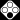

# Lindbergh

Arcade - Année de création : 2005

{% embed url="https://fr.wikipedia.org/wiki/Lindbergh_(syst%C3%A8me_d'arcade)" %}

## Information

<table data-header-hidden><thead><tr><th width="224"></th><th></th></tr></thead><tbody><tr><td><strong>Émulateur</strong></td><td><ul><li>linuxloader</li><li>teknoparrot</li></ul></td></tr><tr><td><strong>Dossier des jeux</strong></td><td>📂 roms \ 📂 lindbergh</td></tr><tr><td><strong>Extensions</strong></td><td>.game</td></tr></tbody></table>

## Fonctionnalités

<table><thead><tr><th width="256">Succès Rétro</th><th width="243">Parties en Réseau</th><th>Autoconfiguration contrôles</th></tr></thead><tbody><tr><td>NON</td><td>NON</td><td>OUI</td></tr></tbody></table>

## BIOS

Aucun BIOS nécessaire.

## Contrôles

### Standard

| Contrôles Lindbergh | Manette                                                                           | Clavier                 |
| ------------------- | --------------------------------------------------------------------------------- | ----------------------- |
| TEST                | R3                                                                                | 9                       |
| SERVICE             | L3                                                                                | 0                       |
| P1 CRÉDIT           | SELECT                                                                            | 5                       |
| P2 CRÉDIT           | SELECT                                                                            | 6                       |
| P1 START            | START                                                                             | 1                       |
| P2 START            | START                                                                             | 2                       |
| DIRECTIONS          | D-PAD & Left stick                                                                | Flèches directionnelles |
| BOUTON 1            |      | CTRL gauche             |
| BOUTON 2            |  | ALT gauche              |
| BOUTON 3            |  | Espace                  |
| P1 Card insert      | GUIDE                                                                             | F7                      |

### Jeux de conduite

<table><thead><tr><th>Contrôles Lindbergh</th><th width="240">Manette</th><th>Clavier</th></tr></thead><tbody><tr><td>Direction</td><td>Stick gauche horizontale</td><td>GAUCHE / DROITE</td></tr><tr><td>Accélération</td><td>R2</td><td>HAUT</td></tr><tr><td>Freinage</td><td>L2</td><td>BAS</td></tr><tr><td>Changement de vue</td><td></td><td>MAJ gauche</td></tr><tr><td>Boost</td><td></td><td>CTRL gauche</td></tr><tr><td>Boost droite</td><td></td><td>ALT gauche</td></tr><tr><td>Vitesse supérieure</td><td>R1</td><td>X</td></tr><tr><td>Vitesse inférieure</td><td>L1</td><td>Z</td></tr><tr><td>Changement de musique</td><td></td><td>Espace</td></tr></tbody></table>

### Simulateur de vol

| Contrôles Lindbergh | Manette                                                                           | Clavier                |
| ------------------- | --------------------------------------------------------------------------------- | ---------------------- |
| Direction de vol    |  Stick gauche / D-PAD                                                             | Flèches de déplacement |
| Manette des gaz     | Axe vertical droit / gâchettes                                                    |                        |
| Accélération        | R1                                                                                | X                      |
| Ralentissement      | L1                                                                                | Z                      |
| Commutateur Climax  |  | MAJ gauche             |
| Détente             |  | CTRL gauche            |
| Missile             |  | ALT gauche             |

### Jeux de tir

| Contrôles Lindbergh | RetroBat                   |
| ------------------- | -------------------------- |
| Cible               | Souris                     |
| Détente             | Bouton de gauche de souris |
| Recharger           | Bouton de droite de souris |
| Bouton pistolet     | Bouton centrale de souris  |
| Bouton action       | R                          |
| Pédale gauche       | Gauche                     |
| Pédale droite       | Droite                     |


Il est possible de définir des boutons spécifiques pour le pistolet (recharge, bouton d'action, bouton pistolet) dans **Options avancées > Pistolets**


#### Multigun - Demulshooter

Linuxloader ne permet pas le raw input pour activer le mode multijoueur dans les jeux de tir. Cependant, l'utilisation de Demulshooter le permet.

Pour activer DemulShooter, vous devez le télécharger depuis la section téléchargement de RetroBat :

<figure><figcaption></figcaption></figure>

Puis, vous devez l'activer pour le jeu :

<figure><figcaption></figcaption></figure>

Enfin, assurez-vous que le nom du fichier de jeu (le nom du dossier avec l'extension .game ou le fichier .game) corresponde exactement a ce qui est attendu par DemulShooter :

| Jeu                             | Nom attendu |
| ------------------------------- | ----------- |
| 2 Spicy                         | 2spicy      |
| Ghost Squad Evolution           | gsevo       |
| The House Of The Dead 4         | hotd4       |
| The House Of The Dead 4 Special | hotd4sp     |
| The House Of The Dead EX        | hotdex      |
| Let's Go Jungle                 | lgj         |
| Let's Go Jungle Special         | lgjsp       |
| Rambo                           | rambo       |

### Utilisation du fichier controls.ini

Vous pouvez utiliser votre propre fichier controls.ini avec l'option suivante, situé dans le menu OPTIONS AVANCÉES > CONTRÔLES :

<figure><figcaption></figcaption></figure>

## Informations spécifiques au système

### Ajouter un jeu

Les jeux peuvent être ajoutés :

* En renommant le dossier contenant le jeu avec l'extension .game

<figure><figcaption></figcaption></figure>

* En créant un fichier .game a côté du fichier elf de démarrage

<figure><figcaption></figcaption></figure>

### Menu Test

Le menu Test contient des options permettant des ajustements dans le jeu lui-même, comme par exemple le calibrage de la réticule de visée ou la sélection du niveau de difficulté.&#x20;

Le menu Test peut être activé en activant l'option **TEST MODE** :

<figure><figcaption></figcaption></figure>
