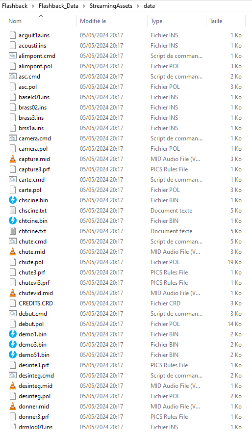
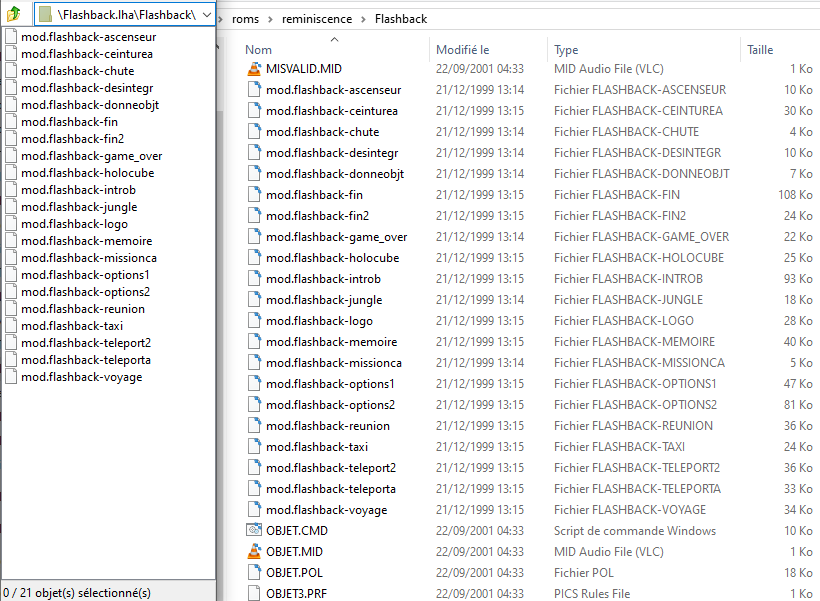
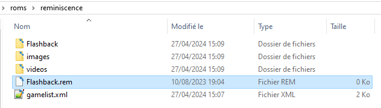

# REminiscence

<figure><figcaption></figcaption></figure>

Moteur de jeu permettant de jouer à Flashback.



## Informations

<table data-header-hidden><thead><tr><th width="224"></th><th></th></tr></thead><tbody><tr><td><strong>Émulateur</strong></td><td><ul><li>Libretro : REminiscence</li></ul></td></tr><tr><td><strong>Dossier des jeux</strong></td><td>📂 roms \ 📂 reminiscence</td></tr><tr><td><strong>Extensions</strong></td><td>.rem</td></tr></tbody></table>

## Bios

Aucun BIOS nécessaire.

## Contrôles

| Retrobat                                       | REminiscence       |
| ---------------------------------------------- | ------------------ |
| START                                          |                    |
| SELECT                                         |                    |
| D-PAD                                          | D-PAD              |
| Stick analogique gauche                        | Directions         |
| Stick analogique droit                         |                    |
| .png>) | Inventaire / Echap |
| .png>) | Draw / Holster     |
| .png>)  | Utiliser           |
| .png>) | Action             |
| L1                                             |                    |
| R1                                             |                    |
| L2                                             |                    |
| R2                                             |                    |

## Information spécifique au système

### Organisation des fichiers de jeux

REminiscence fonctionne avec les fichiers de jeu Flashback, de Delphine Software. Il est possible d'utiliser les fichiers des versions DOS, PC-CD, Amiga, Macintosh, ou bien d'utiliser les fichiers disponibles sous les plateformes [GOG ](https://www.gog.com/game/flashback)ou [STEAM](https://store.steampowered.com/app/961620/Flashback/).&#x20;

A l'interieur du dossier `roms\reminiscence`, créer un nouveau dossier `Flashback`. A l'intérieur de ce dossier, placer les fichiers de jeu que vous pouvez trouver dans le dossier `Flashback_Data\StreamingAssets\data` de votre dossier de jeu Flashback :

<figure><figcaption></figcaption></figure>

Les niveaux pourront être chargés, mais certaines voix et musiques pourraient être manquantes. Pour y pallier, il est possible d'utiliser les fichiers musiques d'Amiga de Raphaël Gesqua, en les déplaçant à l'interieur du dossier Flashback.

<figure><figcaption></figcaption></figure>

Enfin, pour que RetroBat puisse reconnaitre et lancer le jeu, créer un fichier texte vide à l'interieur du dossier `roms\reminiscence`, que vous renommerez `Flashback` avec l'extension de fichier `.REM`

<figure><figcaption></figcaption></figure>

