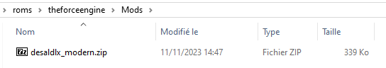

# The Force Engine

<figure><figcaption></figcaption></figure>

Moteur de jeu permettant de jouer à Dark Forces.



## Information

<table data-header-hidden><thead><tr><th width="224"></th><th></th></tr></thead><tbody><tr><td><strong>Émulateurs</strong></td><td><ul><li>theforceengine</li></ul></td></tr><tr><td><strong>Dossier des jeux</strong></td><td>📂 roms \ 📂 theforceengine</td></tr><tr><td><strong>Extensions</strong></td><td>.game</td></tr></tbody></table>

## Bios

Aucun BIOS nécessaire.

## Contrôles


Il n'y a pas de configuration automatique des contrôles pour Dark Forces, les touches peuvent être paramétrées depuis l'émulateur.


## Information spécifique au système

### Organisation des fichiers

Le jeu DOS original (ou une des versions disponibles sur STEAM ou GOG) doivent être copiées dans le dossier `roms\theforceengine` de votre installation RetroBat.

#### Exemple de structure de jeu :

L'exemple suivant contient la version original DOS du jeu:

<figure><figcaption></figcaption></figure>

Créer un fichier texte dans le même dossier que l'exécutable du jeu puis renommer le fichier avec l'extension ".game".\
 

### Lancer des mods

RetroBat permet le lancement de mods pour TheForceEngine.\
Les mods doivent être placés dans le dossier `roms\theforceengine\Mods` de RetroBat.

<figure><figcaption></figcaption></figure>

Pour activer le mod dans RetroBat, créer un fichier texte avec un nom facilement identifiable (ce nom sera affiché dans la liste de jeux RetroBat).

A l'intérieur du fichier .txt, indiquer le nom complet du mod (avec son extension).

Sauvegarder le fichier, et renommer l'extension `.txt` en `.game`

<figure><figcaption></figcaption></figure>

