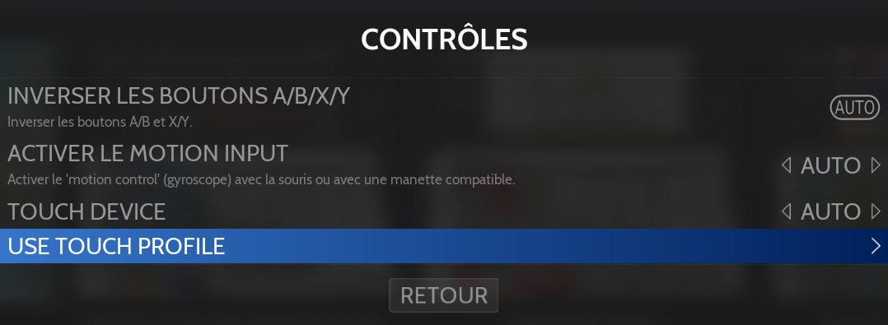

# Nintendo 3DS

<figure><picture><source srcset="https://raw.githubusercontent.com/fabricecaruso/es-theme-carbon/91d85c7849cc550b0cac4e75cb8e0923d3b61b5e/art/logos/3ds-w.svg" media="(prefers-color-scheme: dark)"></picture><figcaption></figcaption></figure>

Console de jeu portable - Durée de vie : 2011 - 2020



## Information

<table data-header-hidden><thead><tr><th width="184"></th><th></th><th data-hidden></th></tr></thead><tbody><tr><td><strong>Émulateurs</strong></td><td><ul><li>azahar</li><li>libretro-azahar</li><li>mandarine</li><li>citra</li><li>bizhawk: encore</li></ul></td><td></td></tr><tr><td><strong>Dossier des jeux</strong></td><td>📁 roms \ 📂 3ds</td><td></td></tr><tr><td><strong>Extensions</strong></td><td>.3ds .3dsx .z3dsx .cia .zcia .elf .axf .cci .zcci .cxi .zcxi .app .m3u .zip .7z .squashfs</td><td></td></tr></tbody></table>

## Fonctionnalités

<table><thead><tr><th width="210">Succès Rétro</th><th width="243">Parties en Réseau</th><th>Auto configuration des contrôles</th></tr></thead><tbody><tr><td>NON</td><td>NON</td><td>
Azahar : OUI

lr-azahar : OUI

Mandarine : OUI Citra : OUI BizHawk : OUI
</td></tr></tbody></table>

## BIOS

Aucun BIOS nécessaire.

## Contrôles


L'écran tactile de la 3DS est difficilement émulable, la meilleure solution est de connecter une souris.

Il est possible de simuler l'utilisation du touchscreen avec le stick droit de la manette, mais le mouvement n'est pas optimisé.


### Schéma de contrôle standard

<figure><figcaption></figcaption></figure>

L'option ci-dessous permet d'inverser les boutons pour correspondre au schéma XBOX:

<figure><figcaption></figcaption></figure>

<figure><figcaption></figcaption></figure>

### Gestion de l'écran tactile:

Selon l'émulateur, et les options définies depuis le menu RetroBat, la souris ou le stick droit permettent de simuler les mouvements sur l'écran tactile.

Azahar, Mandarine et Citra permettent également de sélectionner un profil tactile spécifique, créer depuis l'émulateur : &#x20;

<figure><figcaption></figcaption></figure>


Vous devez vous souvenir du nom du profil crée et le renseigner dans RetroBat


### Disposition de boutons supplémentaires

D'autres configurations de boutons sont disponibles selon les émulateurs, elles sont disponibles depuis le menu Configuration avancée du système > Contrôles :&#x20;

<figure><figcaption></figcaption></figure>

| Option                                                                                                                        | Schéma de contrôles                                                                                                                                   |
| ----------------------------------------------------------------------------------------------------------------------------- | ----------------------------------------------------------------------------------------------------------------------------------------------------- |
| 
<strong>Stick de droite comme pointeur d'écran tactile</strong>  Libretro-Azahar Bizhawk
                      |                                                                     |
| 
<strong>Stick de droite comme pointeur d'écran tactile (inversé)</strong>  Libretro-Azahar Bizhawk
            |                                                                     |
| 
<strong>Stick de droite comme C-stick et pointeur d'écran tactile</strong>  Libretro-Azahar Bizhawk
           |         |
| 
<strong>Stick de droite comme C-stick et pointeur d'écran tactile (inversé)</strong>  Libretro-Azahar Bizhawk
 |  |

## Information spécifique au système

### Emplacement des données

<table><thead><tr><th width="254">Données</th><th>Chemin (relatif au dossier RetroBat)</th></tr></thead><tbody><tr><td>nand path</td><td>saves\3ds\&#x3C;emulator>\nand</td></tr><tr><td>sdmc path</td><td>saves\3ds\&#x3C;emulator>\sdmc</td></tr><tr><td>config file</td><td>emulators\&#x3C;emulator>\user\config\qt-config.ini</td></tr></tbody></table>

### Lancer des applications installées dans la NAND

Pour lancer un jeu qui a été installé dans la mémoire de la NAND de la console, il est possible d'utiliser un fichier .m3u pointant vers le fichier .app du jeu.

Exemple de jeu installé dans la NAND:

<figure><figcaption></figcaption></figure>

Créer un raccourci en cliquant avec le bouton droit sur le jeu depuis l'émulateur:

<figure><figcaption></figcaption></figure>

Depuis le bureau Windows, effectuer un clic droit > propriétés, puis copier le contenu du raccourci dans un fichier .txt (ne garder que la dernière partie du chemin de l'application, sans les ""):

<figure><figcaption></figcaption></figure>

Sauvegarder le fichier avec l'extension .m3u et le placer dans roms\3ds:

<figure><figcaption></figcaption></figure>

### Textures personnalisées

Les émulateurs Lime3DS et Citra permet l'utilisation de packs de textures personnalisés.

Les textures doivent être copiées dans le dossier `\emulators\`<mark style="color:purple;">`<émulateur>`</mark>`\User\Load\Textures\<gameID>`, par exemple pour le jeu Super Mario 3D Land:

<figure><figcaption></figcaption></figure>


Pour le core libretro, les textures sont à positionner dans le dossier:

`\saves\3ds\citra\Load\Textures\<gameID>`


Le nom du dossier dans lequel il faut copier les textures peut être retrouvé en effectuant un clic-droit sur le jeu dans l'interface de l'émulateur, puis en sélectionnant l'option "Ouvrir l'emplacement personnalisé des textures".

<figure><figcaption></figcaption></figure>

Une fois le pack de textures correctement copié, activer les textures personnalisées dans RetroBat:

<figure><figcaption></figcaption></figure>

<figure><figcaption></figcaption></figure>

<figure><figcaption></figcaption></figure>

