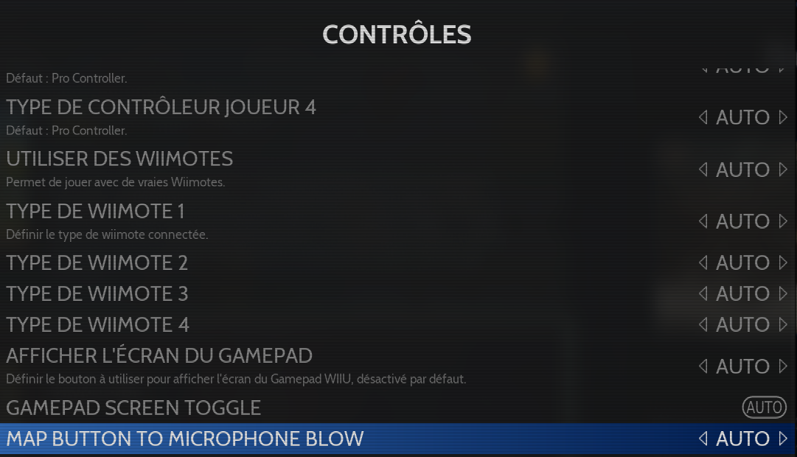
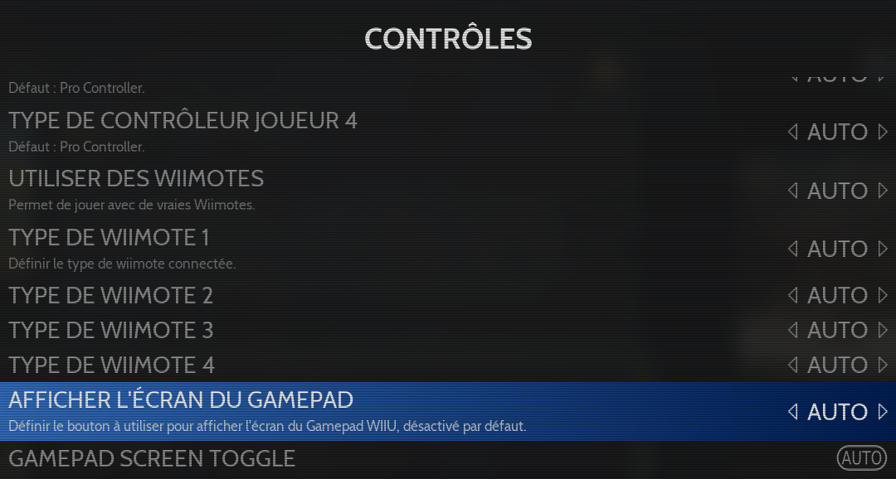

# WiiU

<figure><picture><source srcset="https://raw.githubusercontent.com/fabricecaruso/es-theme-carbon/91d85c7849cc550b0cac4e75cb8e0923d3b61b5e/art/logos/wiiu-w.svg" media="(prefers-color-scheme: dark)"></picture><figcaption></figcaption></figure>

Console de jeu hybride - Durée de vie: 2012 - 2017



## Information

<table data-header-hidden><thead><tr><th width="184"></th><th></th><th data-hidden></th></tr></thead><tbody><tr><td><strong>Émulateur</strong></td><td><ul><li>cemu</li></ul></td><td></td></tr><tr><td><strong>Dossier des jeux</strong></td><td>📁 roms \ 📂 wiiu</td><td></td></tr><tr><td><strong>Extensions</strong></td><td>.iso .rpx .wud .wux .wua .m3u</td><td></td></tr></tbody></table>

## Fonctionnalités

<table><thead><tr><th width="256">Succès Rétro</th><th width="243">Parties en Réseau</th><th>Auto configuration des contrôles</th></tr></thead><tbody><tr><td>NON</td><td>NON</td><td>OUI</td></tr></tbody></table>

## BIOS

Aucun BIOS n'est nécessaire pour jouer, cependant, si vous utilisez des fichiers .wud ou .wux pour vos jeux, il est nécessaire de placer un fichier `keys.txt` comprenant les clés de décryptage de vos jeux dans un dossier de l'émulateur.

Le fichier keys.txt peut être extrait de votre console de jeu WiiU, voir le [guide CEMU ](https://wiki.cemu.info/wiki/Obtaining_Keys_for_Keys.txt)pour plus d'informations.

## Contrôles


Les contrôleurs suivants peuvent être autoconfigurés depuis RetroBat dans Dolphin:

* Contrôleurs XInput
* Dualshocks & DualSense
* Nintendo Switch Pro


| RetroBat                                                                           | WiiU                               |
| ---------------------------------------------------------------------------------- | ---------------------------------- |
| START                                                                              | +                                  |
| SELECT / BACK                                                                      | -                                  |
| D-PAD                                                                              | D-PAD                              |
| Stick analogique gauche                                                            | Stick analogique gauche            |
| Stick analogique droit                                                             | Stick analogique droit             |
|  (1).png>)                             | 
B ou A si option inversé
 |
|  (1) (1).png>)                          | 
A ou B si option inversé
 |
|  | 
X ou Y si option inversé
 |
|      | 
Y ou X si option inversé
 |
| LB (L1)                                                                            | L                                  |
| RB (R1)                                                                            | R                                  |
| L2                                                                                 | ZL                                 |
| R2                                                                                 | ZR                                 |
| L3                                                                                 | L3                                 |
| R3                                                                                 | R3                                 |

L'option pour inverser les boutons est disponible ici:

<figure><figcaption></figcaption></figure>

### Jouer avec des wiimotes

Cemu permet de jouer avec de vraies wiimotes si celles-ci sont connectées au PC (DolphinBar ou via Bluetooth).

Pour cela, sélectionner l'option "**UTILISER DES WIIMOTES**" dans les options avancées du système ou du jeu:

<figure><figcaption></figcaption></figure>

Il est possible pour chaque joueur de définir le type de wiimote connectée.

### Contrôle des mouvements (motion control)

Dans certains jeux, il est indispensable d'avoir accès au gyroscope de la manette pour pouvoir avancer (par exemple certains donjons de Zelda Breath of The Wild nécessitent d'effectuer des mouvements avec la manette).

Le [wiki CEMU](https://wiki.cemu.info/wiki/Motion_controls) contient toutes les informations nécessaires pour gérer cela.

Les contrôleurs compatibles à l'heure actuelle sont les manettes Switch Pro, 8Bitdo (en mode Pro Controller) et DualSense.

### Microphone

Cemu permet le paramétrage d'une touche en tant que bouton du microphone. Il peut être configuré dans les options avancées de RetroBat pour le système :

<figure><figcaption></figcaption></figure>


L'option est seulement disponible lors de l'utilisation du WiiU Gamepad en tant que manette émulée.


### Afficher l'écran du Gamepad&#x20;

Cemu permet de configurer un bouton pour basculer entre l'affichage principal et l'écran du WiiU Gamepad. Il peut être configuré dans les options avancées de RetroBat pour le système, et il est également possible de choisir si le bouton doit être pressé ou maintenu :

<figure><figcaption></figcaption></figure>


L'option est seulement disponible lors de l'utilisation du WiiU Gamepad en tant que manette émulée.


## Information spécifique au système

### Emplacement des fichiers

<table><thead><tr><th width="276">Fichier(s)</th><th>Chemin (relatif au dossier RetroBat)</th></tr></thead><tbody><tr><td>mlc01</td><td>saves\wiiu\cemu\mlc01</td></tr><tr><td>Fichier de configuration</td><td>emulators\cemu\portable\settings.xml</td></tr><tr><td>Configuration des contrôleurs</td><td>emulators\cemu\portable\controllerProfiles Chaque contrôleur dans un fichier .xml</td></tr></tbody></table>

### Ajouter des jeux

Le format recommandé pour l'ajout des jeux WiiU est le format appelé "Bootloader".&#x20;

Il s'agit du format utilisé lorsque vous extrayez (dumpez) des jeux de votre console WiiU.

Dans ce format, les jeux sont extraits dans un dossier comrpenant 3 sous-dossiers, par exemple:

<figure><figcaption>
Example of dumped Zelda game
</figcaption></figure>

Il existe 2 méthodes pour ajouter les jeux au format "BootLoader" dans Retrobat.

#### Installer le jeu dans Cemu et utiliser un fichier m3u

Cette méthode simule l'installation du jeu sur la mémoire NAND de la WiiU, comme lors de l'achat de la version digitale du jeu.

Depuis Retrobat (ou depuis le dossier `\emulators\cemu`), lancer l'émulateur Cemu et choisir Fichier > Installer un jeu, une mise à jour ou un DLC

<figure><figcaption>
File > Install
</figcaption></figure>

Chercher le fichier "meta.xml" qui se trouve dans le dossier `\meta` du jeu et lancer l'installation

<figure><figcaption></figcaption></figure>

Attendre la fin de l'installation du jeu, le jeu est désormais listé dans l'émulateur

<figure><figcaption></figcaption></figure>

<figure><figcaption></figcaption></figure>

Effectuer un clic droit sur le jeu et choisir "Dossier du jeu"

<figure><figcaption></figcaption></figure>

L'explorateur windows ouvre le répertoire du jeu dans lequel se trouve le fichier .rpx

<figure><figcaption></figcaption></figure>

Quitter Cemu et ouvrir le dossier `\roms\wiiu`, puis créer un fichier `<nom du jeu>.m3u` dont le contenu est le suivant:

`\..\..\saves\wiiu\cemu\mlc01\usr\title\`<mark style="color:red;">`<chemin du jeu>`</mark>`\`<mark style="color:red;">`*`</mark>`.rpx`

Par exemple pour le jeu Zelda Breath of the Wild:

<figure><figcaption></figcaption></figure>

Sauvegarder le fichier .m3u, le jeu est désormais disponible dans Retrobat et peut être scrapé et lancé.

#### Placer le dossier du jeu directement dans le dossier des jeux

Cette méthode simule la présence d'une cartouche de jeu WiiU.&#x20;

Placer le dossier au format "BootLoader" dans le répertoire `\roms\wiiu`&#x20;

<figure><figcaption></figcaption></figure>

Le jeu sera disponible dans Retrobat pour être scrapé et lancé.

Retrobat détecte la présence du fichier **.rpx** dans le dossier `\code` du jeu

<figure><figcaption></figcaption></figure>

Screenscraper reconnaît automatiquement U-King comme étant le jeu Zelda Breath of the Wild

<figure><figcaption></figcaption></figure>

### Mises à jour et DLC

Les mises à jour et DLC de vos jeux doivent être installés directement dans l'émulateur Cemu en utilisant l'option "install title, update or DLC" du menu. Le format des mises à jour et des DLC est identique au format des jeux, ils se présentent sous la forme de dossiers au format "Bootloader".

Ouvrir Cemu et choisir **install game title, update or DLC**

<figure><figcaption>
Select the install option
</figcaption></figure>

Aller au répertoire \meta dans le dossier de la mise à jour ou du DLC et sélectionner le fichier meta.xml pour lancer l'installation:

<figure><figcaption>
search for the meta.xml file in the meta folder
</figcaption></figure>

Attendre la fin de l'installation.

<figure><figcaption></figcaption></figure>

Cemu affiche la version ou le niveau du DLC dans les colonnes "Version" et "DLC".

<figure><figcaption></figcaption></figure>

### Packs graphiques

Cemu permet l'utilisation de Packs graphiques afin d'améliorer le rendu visuel des jeux mais aussi pour résoudre des bugs sur certains titres.

Les packs graphiques ne sont pas gérés dans RetroBat et doivent être appliqués directement dans l'émulateur. Dès lors, ils seront automatiquement au démarrage du jeu lorsqu'il sera lancé depuis RetroBat.

Procéder comme suit pour utiliser les packs graphiques.

* Ouvrir CEMU et sélectionner "Options > Packs graphiques":

<figure><figcaption></figcaption></figure>

* Cliquer sur "Télécharger les derniers packs graphiques de la communauté" (coin bas droit de l'écran)

<figure><figcaption></figcaption></figure>

Attendre la fin du téléchargement.

* Consulter la liste des options disponibles pour votre jeu et activer les options nécessaires

<figure><figcaption></figcaption></figure>

Dans cet exemple, l'option sélectionnée "Title Screen Crash Fix" est indispensable pour éviter un crash à l'écran titre du jeu "New Super Mario Bros WiiU"

* Une fois terminé, quitter CEMU

La configuration des packs graphiques sera automatiquement sauvegardée.


Il est possible de trouver des renseignements sur la page de compatibilité des jeux CEMU:

[https://compat.cemu.info/](https://compat.cemu.info/)

