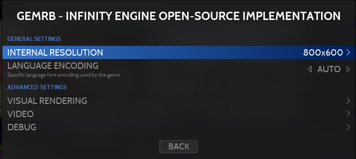

# GemRB

<figure><picture><source srcset="https://files.gitbook.com/v0/b/gitbook-x-prod.appspot.com/o/spaces%2FexdzL60ZuqPLldz2AYta%2Fuploads%2Fl16ARVvaQm02NFhnDuhF%2Fgemrb.png?alt=media&#x26;token=c1be91fd-b805-4c05-a6ed-5bbc80420720" media="(prefers-color-scheme: dark)"></picture><figcaption></figcaption></figure>

GemRB - Implémentation Open-Source du moteur Infinity



## Information

<table data-header-hidden><thead><tr><th width="184"></th><th></th><th data-hidden></th></tr></thead><tbody><tr><td><strong>Émulateur</strong></td><td><ul><li>gemrb</li></ul></td><td></td></tr><tr><td><strong>Dossier des jeux</strong></td><td>📂roms \ 📂 gemrb</td><td></td></tr><tr><td><strong>Extensions</strong></td><td>.auto .bg1 .bg2 .how .iwd .iwd2 .pst</td><td></td></tr></tbody></table>

## BIOS

Aucun BIOS nécessaire.

## Contrôles

Les contrôles sont gérés dans le jeu.&#x20;

Les jeux GemRB / Infinity Engine sont prévus pour êtres joués à la souris et au clavier.&#x20;

Les écrans tactiles sont compatibles et permettent de simuler la souris.&#x20;

Les jeux consistent principalement en action "point-and-click" et en combinaison de touches, comme la plupart des jeux de rôles et jeux de stratégie en temps réel.

## Informations spécifiques au système

GemRB est une implémentation open-source du moteur de jeu Bioware Infinity, est permet de faire fonctionner des jeux comme Baldur's Gate, Icewind Dale et Planescape Torment, ainsi que leurs extensions, suites et "mods".

GemRB est en développement continu depuis plus de 20 ans et, même si l'accent à été mis sur la compatibilité des jeux, ils ne sont pas exempts de défauts ou bugs.

Ci-dessous un point sur la compatibilité actuelle :

<table><thead><tr><th width="253">Jeux</th><th width="159" align="center">Jouable</th><th width="157" align="center">Complet</th><th align="center">Abouti</th></tr></thead><tbody><tr><td>Baldur's Gate</td><td align="center">OUI</td><td align="center">OUI</td><td align="center">OUI</td></tr><tr><td>Baldur's Gate II</td><td align="center">OUI</td><td align="center">OUI</td><td align="center">OUI</td></tr><tr><td>Icewind Dale</td><td align="center">OUI</td><td align="center">OUI</td><td align="center">OUI</td></tr><tr><td>Icewind Dale II</td><td align="center">OUI</td><td align="center"><mark style="color:red;">NON</mark></td><td align="center"><mark style="color:red;">NON</mark></td></tr><tr><td>Planescape Torment</td><td align="center">OUI</td><td align="center">OUI</td><td align="center"><mark style="color:red;">NON</mark></td></tr><tr><td>Any Enhanced Edition</td><td align="center"><mark style="color:red;">NON</mark></td><td align="center"><mark style="color:red;">NON</mark></td><td align="center"><mark style="color:red;">NON</mark></td></tr><tr><td>New games</td><td align="center"><mark style="color:red;">NON</mark></td><td align="center"><mark style="color:red;">NON</mark></td><td align="center"><mark style="color:red;">NON</mark></td></tr></tbody></table>

### Ajouter un jeu GemRB

Les jeux originaux publiés par Bioware et Black Isle sont nécessaires. L'édition "enhanced" distribuée par Beamdog n'est pas compatible.&#x20;

Pour chaque jeu, il est nécessaire de créer un dossier contenant l'intégralité des fichiers du jeu.

&#x20;Le nom du dossier doit se terminer par un point suivi de l'identifiant du jeu, chaque jeu dispose de son propre identifiant:

<table><thead><tr><th width="545">Jeux</th><th align="center">Identifiants</th></tr></thead><tbody><tr><td>Baldur's Gate +/- Tales of the Sword Coast</td><td align="center">bg1</td></tr><tr><td>Baldur's Gate II - Shadows of Amn +/- Throne of Bhaal</td><td align="center">bg2</td></tr><tr><td>Icewind Dale (without any extension)</td><td align="center">iwd</td></tr><tr><td>Icewind Dale - Heart of Winter +/- Trial of the Luremaster</td><td align="center">how</td></tr><tr><td>Icewind Dale II</td><td align="center">iwd2</td></tr><tr><td>Planescape Torment</td><td align="center">pst</td></tr><tr><td>Pour tester l'autodetection des jeux</td><td align="center">auto</td></tr></tbody></table>

Par exemple, pour le jeu Baldur's Gate :

<figure><figcaption>
Exemple d'un dossier de jeu GemRB
</figcaption></figure>

### Modifier la résolution d'un jeu

Si aucun mod graphique permettant l'affichage en écran large n'est installé, les jeux seront affichés  dans leur résolution d'origine.

Ci-dessous la liste des résolutions compatibles :

<table data-header-hidden><thead><tr><th width="329">Games</th><th>Native resolutions</th></tr></thead><tbody><tr><td>Baldur's Gate +/- Tales of the Sword Coast</td><td>640x480</td></tr><tr><td>Baldur's Gate II - Shadows of Amn +/- Throne of Bhaal</td><td>640x480 / 800x600 / 1024x768 / 1280x960</td></tr><tr><td>Icewind Dale (without any extension)</td><td>640x480</td></tr><tr><td>Icewind Dale - Heart of Winter +/- Trial of the Luremaster</td><td>640x480 / 800x600 / 1024x768 / 1280x960</td></tr><tr><td>Icewind Dale II</td><td>800x600 / 1024x768 / 1280x960</td></tr><tr><td>Planescape Torment</td><td>640x480</td></tr></tbody></table>

Pour modifier la résolution du jeu, il faut éditer l'option permettant de changer la **Résolution Interne** depuis RetroBat :

<figure><figcaption></figcaption></figure>

<figure><figcaption></figcaption></figure>

Contrairement aux autres systèmes, il est nécessaire de renseigner manuellement dans un champs de saisie la résolution à utiliser pour le jeu, par exemple 800x600 :

<figure><figcaption></figcaption></figure>

<figure><figcaption></figcaption></figure>

Sans précision sur la résolution à utiliser, le jeu démarrera par défaut dans la résolution la plus faible.

### Mods écran large

Pour une résolution d'écran plus moderne avec une écran large, il est nécessaire d'appliquer un patch écran large au jeu. Selon le jeu, il se peut que d'autres mods soient nécessaires pour que l'interface du jeu soit correctement affichée.

Les mods écran large sint disponibles [ici](https://www.gibberlings3.net/mods/tools/widescreen/).

Suivre les instructions du mod, puis répéter l'opération au dessus pour remplacer la résolution par celle spécifiée par le mod écran large.


Si la résolution est la même que celle de l'écran, il est possible de saisir "desktop" dans le champs "résolution interne".


<figure><figcaption></figcaption></figure>

