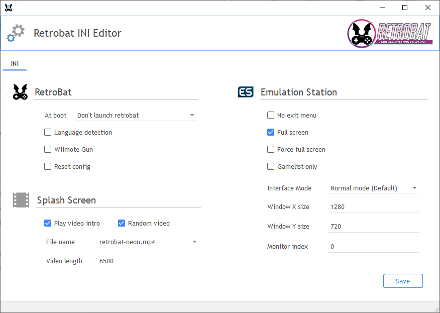
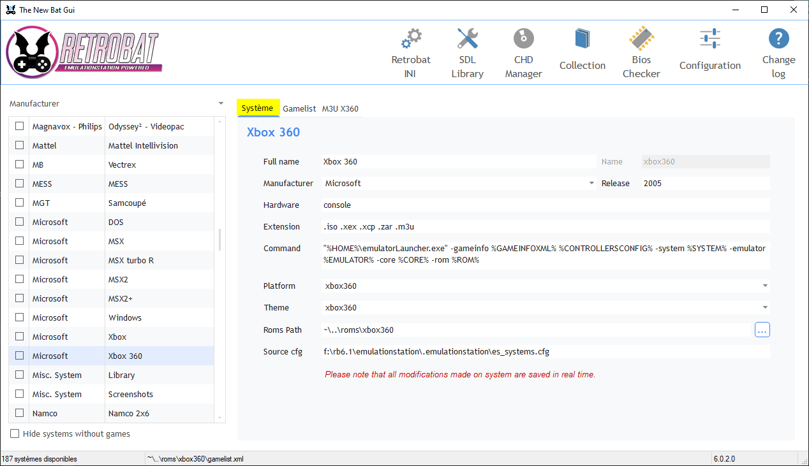
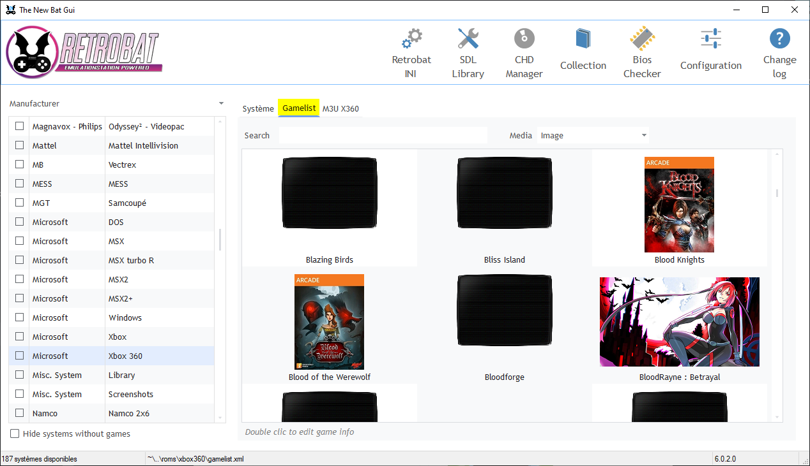
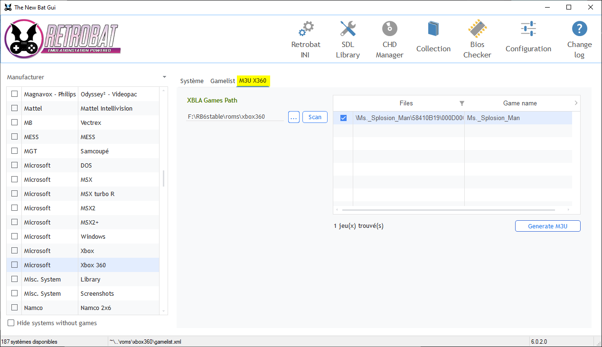

# Batgui

BatGui est un utilitaire disponible dans le dossier d'installation de Retrobat.

<figure><figcaption>
BatGui.exe
</figcaption></figure>

**Cet utilitaire permet:**

* de gérer les paramètres disponibles dans le fichier [retrobat.ini](retrobat.ini.md)
* de gérer la liste des systèmes (fichier es\_systems\*)
* de gérer la gamelist d'un système et les métadatas des jeux
* de créer automatiquement les fichiers m3u pour [PS3](../systemes-and-emulateurs/supported-game-systems/consoles-de-jeu/sony/playstation-3.md#ajouter-les-jeux) et les jeux [Xbox Live Arcade](../systemes-and-emulateurs/supported-game-systems/consoles-de-jeu/microsoft-consoles-de-jeu/xbox-360.md#ajout-dun-jeu-xbla-xbox-live-arcade)
* de convertir vos jeux aux formats ISO/CUE vers le format CHD
* de gérer la bibliothèque SDL (liés aux controlleurs) et de réinitialiser la configuration des manettes

<figure><figcaption></figcaption></figure>

### Gérer le fichier retrobat.ini

Depuis BatGui.exe, il est possible de paramétrer les mêmes éléments que dans le fichier [retrobat.ini](retrobat.ini.md)

<figure><figcaption></figcaption></figure>

### Gérer la liste des systèmes

Depuis ce menu il est possible de modifier le fichier `es_systems.cfg` ou de gérer les fichiers personnalisés (il est par exemple possible de retirer la reconnaissance d'une extension de fichier pour un système).

<figure><figcaption></figcaption></figure>

### Gérer les gamelist

Depuis ce menu il est possible de mettre à jour le fichier `gamelist.xml` pour un système, il est notamment possible de mettre à jour les métadonnées et les médias pour les jeux.

<figure><figcaption></figcaption></figure>

### Générateur de m3u

Ce menu permet la création automatique de fichiers .m3udans les dossiers [`\roms\ps3`](../systemes-and-emulateurs/supported-game-systems/consoles-de-jeu/sony/playstation-3.md#adding-ps3-games) ou [`\roms\xbox360`](../systemes-and-emulateurs/supported-game-systems/consoles-de-jeu/microsoft-consoles-de-jeu/xbox-360.md#adding-xbla-xbox-live-arcade-games) pour les jeux installés dans les émulateurs correspondants aux systèmes PS3 et Xbox360 (jeux Xbox Live Arcade).

<figure><figcaption></figcaption></figure>

### Convertisseur CHD

Cette fonctionnalité permet de convertir les fichiers ISO/CUE au format CHD.

<figure><figcaption></figcaption></figure>

### Gérer la bibliothèque SDL et réinitialiser la configuration des manettes

Le menu "SDL Library Selector" permet de réinitialiser la configuration des manettes. Cela peut être utile en cas de conflit dans les paramétrages des manettes, pour redémarrer depuis une configuration d'origine.\
Il suffit de cliquer sur le bouton "Reset GamePad config", et la configuration ne conservera uniquement que le paramétrage clavier.

<figure><figcaption></figcaption></figure>

Depuis le menu "SDL Library Selector", il est également possible de choisir différentes version de la bibliothèque SDL. Cette option est à utiliser si vous rencontrer des difficultés pour paramétrer vos contrôleurs (manettes, panel d'arcade...).\
Sélectionner un des fichiers DLL dans la liste déroulante, puis cliquez sur "Close". Cliquez ensuite sur "Reset GamePad config", lancer Retrobat et paramétrer les touches.\
Si l'essai n'est pas concluant, recommencer avec une autre DLL. &#x20;

<figure><figcaption></figcaption></figure>

Ceci va réinitialiser le fichier **es\_input.cfg** situé dans le dossier `emulationstation\.emulationstation` de votre installation RetroBat.\
