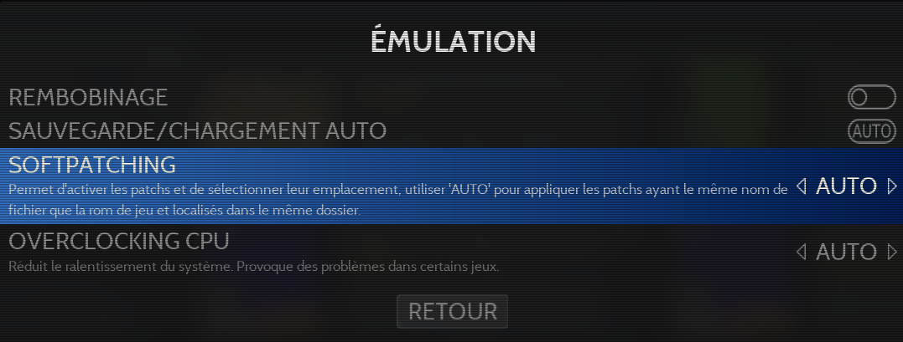
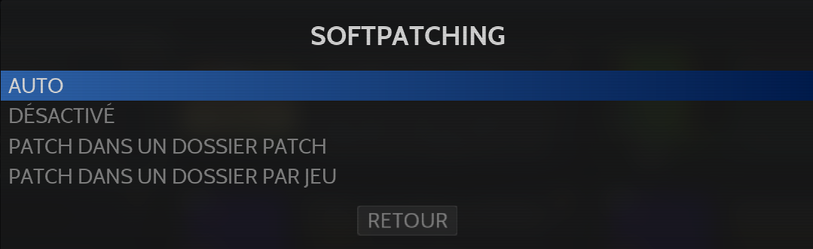

# Softpatching

Un patch est un fichier contenant un certain nombre de modifications apporté à une ROM originale, pouvant être de l'ordre de la correction de bugs, des hacks ou bien plus largement des traductions.\
Le patch peut être de différents formats : `.UPS` (Universal Patching System), `.IPS` (International Patching System), `.BPS` (Binary Patch Support)...

Le softpatching est une fonction permettant d'appliquer ces patchs de jeu, sans avoir à modifier la rom d'origine. Cela permet de définir, en fonction de son envie, quand appliquer ou non les patchs disponibles.

## Mise en place des patchs

Il est possible de faire fonctionner les patchs selon 3 méthodes différentes. En fonction de l'organisation choisie, il faudra choisir l'option correspondante dans le menu RetroBat :&#x20;

<figure><figcaption></figcaption></figure>

<figure><figcaption></figcaption></figure>

* Patch dans le répertoire roms correspondant
  *   Le fichier patch est placé à coté de la rom. Il faudra que le patch soit nommé exactement comme la rom (a l'exception de l'extension)

      > Choisir l'option AUTO dans le menu Softpatching
* Patch dans un sous-répertoire nommé `"patches"`
  *   Dans le système, un sous-répertoire patches contient les patches pour les différents jeux. Ils sont nommés comme les roms pour lesquels ils sont prévus.

      > Choisir l'option PATCH DANS UN DOSSIER PATCH dans le menu Softpatching
* Patch dans un dossier au nom du jeu
  *   Dans le système, un sous-répertoire est nommé comme le jeu. Il pourra alors contenir différents patches, qui seront tous appliqués (sous réserve de compatibilité)

      > Choisir l'option PATCH DANS UN DOSSIER PAR JEU dans le menu Softpatching

## Cores compatibles

Cette fonctionnalité ne fonctionnera que pour les coeurs libretro suivants : \
\
**Bandai - WonderSwan/Color**\
Mednafen\_wswan&#x20;

**Coleco - ColecoVision**\
Gearcoleco&#x20;

**Nec - PC Engine/TurboGrafx-16** \
Mednafen\_pce - Mednafen\_pce\_fast

**Nintendo - Game Boy / Color**\
Gambatte - Mesen - mGBA - TGB Dual - VBA-M

**Nintendo - Game Boy Advance**\
Meteor - mGBA - VBA-M - VBA Next

**Nintendo - NES / Famicom**\
bnes - FCEUmm - Mesen - Nestopia UE - QuickNES

**Nintendo - Satellaview**\
Mesen-S - Snes9x

**Nintendo - SNES / Famicom**\
bsnes - bsnes HD Beta - bsnes JG - bsnes mercury accuracy - bsnes mercury balanced - mednafen\_snes - Mesen-S

**Nintendo - Nintendo 64**\
mupen64plus - parallel

**Sega - Master System**\
SMS Plus GX - Gearsystem

**Sega - MegaDrive / Genesis**\
Genesis Plus GX - Picodrive

**SNK - Neo Geo Pocket / Neo Geo Pocket Color**\
Mednafen\_ngp

